# 🚀 Integración Completa del Sistema de Logística en /create

## 📋 Resumen Ejecutivo

Se ha implementado una integración full-stack del sistema de logística en la página `/create`, permitiendo:

- ✅ **Creación de contratos de envío** con formulario completo
- ✅ **Vista previa en tiempo real** de la red logística activa
- ✅ **Sistema de privacidad** de 3 niveles integrado
- ✅ **Conexión completa** Frontend ↔ Backend ↔ Smart Contract (simulado)
- ✅ **Prevención de recargas** de página durante el envío de formularios

---

## 🏗️ Arquitectura Implementada

### **1. Frontend (React + Vite)**

#### **A. Componentes Actualizados**

**`frontend/src/pages/Create.jsx`**

```jsx
// Nuevo componente: LogisticsPreview
const LogisticsPreview = ({ shipments }) => {
    // Muestra los 3 envíos más recientes de la red
    // Estado en tiempo real con polling cada 5 segundos
}

// LogisticsForm actualizado
const LogisticsForm = () => {
    // Grid layout: Formulario (col-span-2) + Vista Previa (col-span-1)
    // Manejo completo de estado con useState
    // preventDefault() para evitar recargas
    // Integración con sistema de privacidad
}
```

**Características del Formulario:**

- **Campos validados**: Origen, Destino, Tipo de Carga, Peso, Pago en BEZ
- **Sistema de Privacidad**: Público / Privado / Solo Miembros con tarifa de acceso
- **Vista Previa Live**: Muestra hasta 3 envíos activos de la red
- **Manejo de Errores**: Mensajes claros si falla la conexión backend
- **Estados de Loading**: Indicador visual durante creación blockchain

#### **B. Hooks Mejorados**

**`frontend/src/hooks/useLogisticsContract.js`**

```javascript
export const useLogisticsContract = () => {
    const { shipments, loading, createShipment, acceptJob, signDelivery } = ...;
    
    // createShipment actualizado:
    // - Payload estructurado con campos de privacidad
    // - Validación de datos antes de enviar
    // - Manejo de errores con try/catch
    // - Refresco automático de shipments tras creación
    
    return { shipments, loading, createShipment, acceptJob, signDelivery };
}
```

**Funcionalidades del Hook:**

- **Polling automático**: Actualiza shipments cada 5 segundos
- **Integración con Auth**: Usa `user.address` del contexto de autenticación
- **Axios configurado**: Base URL apunta a `http://localhost:3001/api`
- **Payload completo**: Incluye `visibility`, `accessFee`, `shipper`

---

### **2. Backend (Express.js)**

#### **A. Rutas Actualizadas**

**`backend/routes/logistics.routes.js`**

```javascript
// POST /api/logistics/create - Mejorado
router.post('/create', (req, res) => {
    const { origin, destination, cargoType, weight, payout, visibility, accessFee, shipper } = req.body;
    
    // Validación de campos requeridos
    if (!origin || !destination || !cargoType || !payout) {
        return res.status(400).json({ error: "Campos requeridos faltantes" });
    }
    
    // Crear shipment con campos de privacidad
    const newShipment = {
        id: shipmentsDB.length + 1,
        ...campos,
        visibility: visibility || 'public',
        accessFee: accessFee || 0,
        status: "PENDING"
    };
    
    shipmentsDB.push(newShipment);
    res.json(newShipment);
});
```

**Endpoints Disponibles:**

| Método | Ruta | Descripción |
|--------|------|-------------|
| GET | `/api/logistics/shipments` | Obtiene todos los envíos |
| POST | `/api/logistics/create` | Crea nuevo contrato de envío |
| POST | `/api/logistics/accept/:id` | Transportista acepta trabajo |
| POST | `/api/logistics/deliver/:id` | Firma de entrega (escrow release) |

#### **B. Validaciones Implementadas**

```javascript
// Campos requeridos obligatorios
- origin (string)
- destination (string)
- cargoType (string)
- payout (number)

// Campos opcionales con defaults
- weight: "N/A"
- visibility: 'public'
- accessFee: 0
- minTemp, maxTemp: null
```

---

## 🔐 Sistema de Privacidad Integrado

### **Componente PrivacySettings**

```jsx
<PrivacySettings settings={privacy} setSettings={setPrivacy} />
```

**Opciones:**

1. **Público** 🌍
   - Visible en Marketplace para todos
   - Sin restricciones de acceso
   - `visibility: 'public'`, `accessFee: 0`

2. **Privado** 🔒
   - Solo visible para el creador
   - Modo borrador/oculto
   - `visibility: 'private'`

3. **Solo Miembros** 👥
   - Requiere pago en BEZ para desbloquear
   - Configurable vía Smart Contract
   - `visibility: 'members'`, `accessFee: <amount>`

---

## 🔄 Flujo de Datos Completo

```mermaid
graph LR
    A[Usuario en /create] --> B[Completa LogisticsForm]
    B --> C[handleSubmit previene default]
    C --> D[createShipment en Hook]
    D --> E[POST /api/logistics/create]
    E --> F[Backend valida datos]
    F --> G[Crea shipment con privacidad]
    G --> H[Respuesta JSON al frontend]
    H --> I[fetchShipments actualiza lista]
    I --> J[LogisticsPreview muestra actualización]
    J --> K[Usuario ve confirmación + redirect]
```



---

## 📦 Payload de Ejemplo

### **Request Frontend → Backend**

```json
{
  "origin": "Madrid, ES",
  "destination": "Berlín, DE",
  "cargoType": "Electrónica",
  "weight": "500kg",
  "payout": 150,
  "visibility": "members",
  "accessFee": 50,
  "shipper": "0x742d35Cc6634C0532925a3b844Bc9e7595f0bEb"
}
```

### **Response Backend → Frontend**

```json
{
  "id": 3,
  "origin": "Madrid, ES",
  "destination": "Berlín, DE",
  "cargoType": "Electrónica",
  "weight": "500kg",
  "payout": 150,
  "status": "PENDING",
  "carrier": null,
  "recipient": "0x742d35Cc6634C0532925a3b844Bc9e7595f0bEb",
  "visibility": "members",
  "accessFee": 50,
  "temperature": null,
  "minTemp": null,
  "maxTemp": null,
  "history": [
    {
      "status": "Created",
      "timestamp": 1704123456789,
      "location": "Madrid, ES"
    }
  ]
}
```

---

## 🎨 UI/UX Implementado

### **Grid Layout Responsive**

```jsx
<div className="grid grid-cols-1 lg:grid-cols-3 gap-6">
    {/* Formulario (izquierda, 2/3) */}
    <div className="lg:col-span-2">
        <LogisticsForm />
    </div>
    
    {/* Vista Previa (derecha, 1/3) */}
    <div className="lg:col-span-1">
        <LogisticsPreview shipments={shipments} />
    </div>
</div>
```

### **LogisticsPreview - Características**

- **Header**: "Red Logística Activa" con icono de mapa
- **Shipment Cards**: Muestra top 3 con:
  - ID + Ruta (origen → destino)
  - Status con color coded:
    - `PENDING`: Amarillo
    - `IN_TRANSIT`: Azul
    - `DELIVERED`: Verde
  - Tipo de carga + Pago en BEZ
- **Contador**: "+ X envíos más en la red"
- **Estado vacío**: "Cargando red logística..."

---

## 🛠️ Manejo de Errores

### **Frontend**

```jsx
const [error, setError] = useState(null);

try {
    const success = await createShipment({ ...formData, privacy });
    if (success) {
        setSuccess({ type: 'Logística', link: '/logistics' });
    } else {
        setError('Error al crear el envío. Por favor, intenta de nuevo.');
    }
} catch (err) {
    setError('Error de conexión con el servidor.');
    console.error(err);
}
```

**Visualización:**

```jsx
{error && (
    <div className="bg-red-50 border border-red-200 text-red-800 p-4 rounded-lg">
        {error}
    </div>
)}
```

### **Backend**

```javascript
// Validación de campos
if (!origin || !destination || !cargoType || !payout) {
    return res.status(400).json({ 
        error: "Campos requeridos: origin, destination, cargoType, payout" 
    });
}

// Log de confirmación
console.log(`✅ Nuevo envío creado (ID: ${newShipment.id}) con privacidad: ${newShipment.visibility}`);
```

---

## 🚀 Deployment & Testing

### **1. Iniciar Backend**

```bash
cd backend
npm install
npm start
# Servidor en http://localhost:3001
```

### **2. Iniciar Frontend**

```bash
cd frontend
npm install
npm run dev
# Vite en http://localhost:5173
```

### **3. Prueba Manual**

1. Navega a `http://localhost:5173/create`
2. Selecciona "Logística" en el selector de tipo
3. Observa la **vista previa** a la derecha mostrando envíos activos
4. Completa el formulario:
   - Origen: "Barcelona, ES"
   - Destino: "París, FR"
   - Tipo de Carga: "Farmacéuticos"
   - Peso: "300kg"
   - Pago: "200"
5. Configura privacidad (ej: "Solo Miembros" con 25 BEZ)
6. Click en **"Crear Contrato de Envío"**
7. Verifica:
   - ✅ No recarga la página
   - ✅ Loading indicator aparece
   - ✅ Envío se crea en backend (check consola)
   - ✅ Vista previa se actualiza
   - ✅ Mensaje de éxito + redirect a `/logistics`

---

## 📊 Estado de la Base de Datos (In-Memory)

```javascript
// shipmentsDB inicial en backend/routes/logistics.routes.js
[
    {
        id: 1,
        origin: "Puerto de Valencia, ES",
        destination: "Madrid Centro, ES",
        status: "IN_TRANSIT",
        cargoType: "Electrónica",
        payout: "150",
        carrier: "0xCarrier...",
        temperature: 4.2
    },
    {
        id: 2,
        origin: "Barcelona, ES",
        destination: "Lyon, FR",
        status: "PENDING",
        cargoType: "Farmacéuticos",
        payout: "450",
        carrier: null
    }
]
```

Cada nuevo envío se agrega dinámicamente con `id: shipmentsDB.length + 1`

---

## 🔮 Próximos Pasos (Opcionales)

### **Integración con Smart Contract Real**

```solidity
// LogisticsContract.sol
contract LogisticsContract {
    struct Shipment {
        address shipper;
        address carrier;
        string origin;
        string destination;
        uint256 payout;
        ShipmentStatus status;
        VisibilityType visibility;
        uint256 accessFee;
    }
    
    enum VisibilityType { PUBLIC, PRIVATE, MEMBERS }
    
    function createShipment(...) external payable {...}
    function acceptJob(uint256 shipmentId) external {...}
    function signDelivery(uint256 shipmentId) external {...}
}
```

### **Integración con IPFS/Arweave**

- Almacenar documentos de envío en IPFS
- Hash del documento en blockchain
- Descarga descentralizada de manifiestos

### **Sistema de Notificaciones**

- WebSocket para actualizaciones en tiempo real
- Push notifications cuando envío cambia de estado
- Emails automáticos en eventos críticos

---

## 📝 Checklist de Funcionalidades

- [x] Formulario de creación con todos los campos
- [x] Sistema de privacidad de 3 niveles
- [x] Vista previa de red logística en tiempo real
- [x] Prevención de recargas con `preventDefault()`
- [x] Integración completa con backend API
- [x] Validación de datos en frontend y backend
- [x] Manejo de errores con mensajes claros
- [x] Estados de loading/success
- [x] Polling automático cada 5s
- [x] Grid layout responsive
- [x] Documentación completa

---

## 🎓 Referencias Técnicas

- **React Hooks**: `useState`, `useEffect`, Custom Hooks
- **Express.js**: REST API, Middleware, Error Handling
- **Axios**: HTTP Client, Request Configuration
- **Tailwind CSS**: Utility-First, Grid System, Dark Mode
- **React Icons**: FA Icons Library

---

## 👨‍💻 Mantenimiento

### **Actualizar shipmentsDB inicial**

Editar `backend/routes/logistics.routes.js`:

```javascript
let shipmentsDB = [
    // Agregar más envíos de prueba aquí
];
```

### **Modificar campos del formulario**

Editar `frontend/src/pages/Create.jsx` → `LogisticsForm`:

```jsx
const [formData, setFormData] = useState({ 
    // Agregar/quitar campos aquí
});
```

### **Personalizar vista previa**

Editar `frontend/src/pages/Create.jsx` → `LogisticsPreview`:

```jsx
{shipments.slice(0, 3).map(s => (
    // Modificar diseño de cards aquí
))}
```

---

**Fecha de Implementación**: 2024  
**Versión**: 1.0.0  
**Stack**: React 18 + Express 4 + Node.js 18+  
**Estado**: ✅ **Producción-Ready (con backend simulado)**
