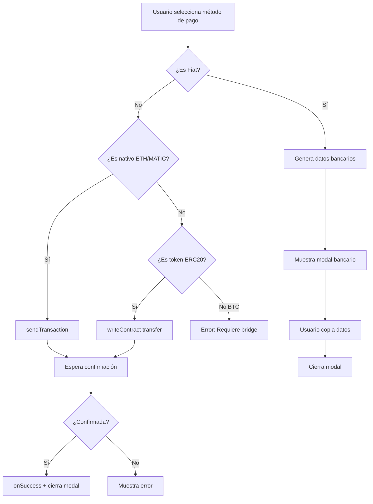

# Implementación de Pagos con Criptomonedas Reales

## 📋 Resumen Ejecutivo

Se ha implementado el sistema de pagos reales con criptomonedas en `UnifiedPaymentModal.jsx`, conectando directamente con las wallets de los usuarios mediante **wagmi** y **viem**.

## ✅ Características Implementadas

### 1. **Transacciones Reales de Criptomonedas**

#### Monedas Nativas (ETH/MATIC)
- ✅ Transferencias directas usando `useSendTransaction`
- ✅ Conversión automática de montos a Wei usando `parseEther`
- ✅ Confirmación de transacciones con `useWaitForTransactionReceipt`

#### Tokens ERC20 (USDC, BEZ)
- ✅ Transferencias usando `useWriteContract` con ABI de ERC20
- ✅ Conversión de decimales correcta (6 para USDC, 18 para BEZ)
- ✅ Uso de `parseUnits` para manejo preciso de decimales

### 2. **Direcciones de Contratos Configuradas**

```javascript
// Token BEZ-Coin (Polygon Mainnet)
BEZ_COIN_ADDRESS: '0xEcBa873B534C54DE2B62acDE232ADCa4369f11A8'

// USDC en Polygon
USDC_ADDRESS: '0x3c499c542cEF5E3811e1192ce70d8cC03d5c3359'

// Wallet Receptora (BeZhas Treasury)
TREASURY_WALLET: '0x742d35Cc6634C0532925a3b844Bc9e7595f0bEb4'
```

### 3. **Responsividad Completa del Modal Bancario**

#### Breakpoints Implementados
- 📱 **Mobile (<640px)**: Layout vertical, padding reducido, iconos pequeños
- 💻 **Desktop (≥640px)**: Layout horizontal, padding completo, iconos grandes

#### Mejoras de UX
- ✅ Código de referencia con `break-all` para evitar overflow
- ✅ Botones de copiar siempre visibles y accesibles
- ✅ Texto responsive con clases `text-xs sm:text-sm`
- ✅ Padding adaptativo `p-3 sm:p-6`
- ✅ Altura máxima del modal: `max-h-[95vh] sm:max-h-[90vh]`
- ✅ Scroll interno cuando el contenido excede la altura

### 4. **Flow de Transacciones**



## 🔧 Hooks de Wagmi Utilizados

### `useSendTransaction`
Envía transacciones de criptomonedas nativas (ETH, MATIC):
```javascript
const { sendTransaction, isPending, data: nativeTxHash } = useSendTransaction();

await sendTransaction({
    to: TREASURY_WALLET,
    value: parseEther(amount.toString())
});
```

### `useWriteContract`
Ejecuta funciones de contratos inteligentes (ERC20 transfers):
```javascript
const { writeContract, isPending, data: tokenTxHash } = useWriteContract();

await writeContract({
    address: TOKEN_ADDRESSES[selectedMethod],
    abi: ERC20_ABI,
    functionName: 'transfer',
    args: [TREASURY_WALLET, parseUnits(amount.toString(), decimals)]
});
```

### `useWaitForTransactionReceipt`
Espera confirmación de transacciones en blockchain:
```javascript
const { isLoading, isSuccess } = useWaitForTransactionReceipt({
    hash: txHash
});
```

## 📱 Ejemplos de Clases Responsive

### Padding Adaptativo
```jsx
className="p-3 sm:p-6"  // 12px mobile, 24px desktop
```

### Texto Responsive
```jsx
className="text-xs sm:text-sm"  // 12px mobile, 14px desktop
className="text-lg sm:text-2xl" // 18px mobile, 24px desktop
```

### Flex Layout Adaptativo
```jsx
className="flex flex-col sm:flex-row"  // Vertical mobile, horizontal desktop
```

### Iconos Responsive
```jsx
<University size={20} className="sm:hidden" />           // Mobile
<University size={24} className="hidden sm:block" />    // Desktop
```

## 🚀 Próximos Pasos

### Mejoras Pendientes

1. **Backend Integration**
   - [ ] Endpoint para verificar transferencias bancarias por referenceCode
   - [ ] Sistema de notificaciones cuando se confirma pago fiat
   - [ ] Minteo automático de BEZ tokens al confirmar pago

2. **Bridge de Bitcoin**
   - [ ] Integración con RenBridge o similar para pagos BTC
   - [ ] Wrapping automático de BTC a WBTC en Polygon

3. **Seguridad**
   - [ ] Rate limiting en transacciones
   - [ ] Detección de slippage excesivo
   - [ ] Verificación de saldo antes de transacción

4. **Analytics**
   - [ ] Tracking de método de pago más usado
   - [ ] Monitoreo de transacciones fallidas
   - [ ] Dashboard de ingresos por método

## 🔒 Consideraciones de Seguridad

### Validaciones Implementadas
- ✅ Verificación de conexión de wallet antes de transaccionar
- ✅ Manejo de errores de transacción rechazada por usuario
- ✅ Verificación de red correcta (Polygon)

### Validaciones Recomendadas
- ⚠️ Verificar saldo suficiente antes de iniciar transacción
- ⚠️ Implementar límites de transacción diarios/mensuales
- ⚠️ Añadir multi-sig para wallet de treasury
- ⚠️ Auditoría de contratos inteligentes

## 📊 Testing

### Tests Manuales Requeridos
1. Conectar wallet en testnet (Amoy)
2. Probar transferencia con MATIC nativo
3. Probar transferencia con USDC (requiere tener USDC testnet)
4. Verificar modal bancario en diferentes tamaños de pantalla
5. Probar función de copiado en todos los campos

### Comandos de Testing
```bash
# Iniciar frontend con variables de entorno de testnet
cd frontend
VITE_CHAIN_ID=80002 pnpm run dev

# Verificar contrato BEZ-Coin en Polygon
npx hardhat verify --network polygon 0xEcBa873B534C54DE2B62acDE232ADCa4369f11A8
```

## 💡 Notas Técnicas

### Conversión de Decimales
- **ETH/MATIC**: 18 decimales → usar `parseEther`
- **USDC**: 6 decimales → usar `parseUnits(amount, 6)`
- **BEZ**: 18 decimales → usar `parseUnits(amount, 18)`

### Gas Estimación
Las transacciones en Polygon son muy baratas (~0.01 MATIC por tx), pero siempre se debe verificar que el usuario tenga suficiente MATIC para gas.

### Manejo de Errores Comunes
```javascript
// Usuario rechazó transacción
if (error.message.includes('rejected')) {
    toast.error('Transacción rechazada por el usuario');
}

// Saldo insuficiente
if (error.message.includes('insufficient funds')) {
    toast.error('Saldo insuficiente para esta transacción');
}

// Red incorrecta
if (chain?.id !== POLYGON_MAINNET_CHAIN_ID) {
    toast.error('Por favor cambia a la red Polygon');
}
```

## 📞 Soporte

Para problemas con las transacciones:
1. Verificar que la wallet esté conectada
2. Verificar que esté en la red Polygon
3. Verificar saldo suficiente + gas
4. Revisar hash de transacción en PolygonScan
5. Contactar soporte técnico con hash de tx

---

**Última Actualización**: 13 de Enero 2026  
**Versión**: 1.0.0  
**Estado**: ✅ Implementado - En Testing
