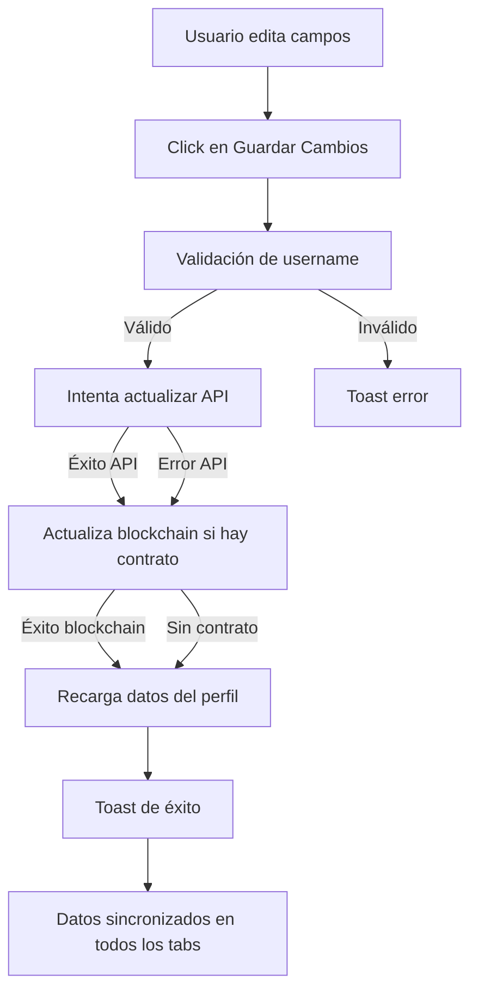

# 🔄 Integración de Configuración en Mi Perfil

## 📋 Resumen de Cambios

Se ha integrado exitosamente la funcionalidad de **Configuración** dentro de la página **Mi Perfil**, creando una experiencia unificada y mejorando la UX.

---

## ✅ Cambios Realizados

### 1. **ProfilePageNew.jsx** - Página Principal Modificada

#### **Imports agregados:**
```jsx
import { Shield, Bell, Save } from 'lucide-react';
```

#### **Nuevos estados agregados:**
```jsx
// Settings states
const [editUsername, setEditUsername] = useState('');
const [editBio, setEditBio] = useState('');
const [isSaving, setIsSaving] = useState(false);
```

#### **Nueva función de actualización de perfil:**
```jsx
const handleUpdateProfile = async () => {
    // 1. Intenta actualizar vía API (backend)
    // 2. Si el contrato está disponible, actualiza en blockchain
    // 3. Recarga los datos del perfil
    // 4. Muestra notificaciones de éxito/error
}
```

#### **Nueva pestaña "Configuración" agregada:**
- ✅ Pestaña añadida al array de tabs
- ✅ Contenido completo de configuración implementado
- ✅ 3 secciones: Cuenta, Seguridad (próximamente), Notificaciones (próximamente)

#### **Campos editables en Configuración:**
- **Nombre de Usuario**: Input de texto
- **Biografía**: Textarea de 4 líneas
- **Dirección de Wallet**: Solo lectura con botón de copiar

#### **Botón "Editar Perfil" actualizado:**
- **Antes:** Navegaba a `/settings` con Link
- **Después:** Cambia a la pestaña `settings` con `onClick`

---

### 2. **sidebarConfig.jsx** - Sidebar Actualizado

#### **Cambio realizado:**
```jsx
// ANTES:
{
  path: '/settings',
  icon: <Settings size={22} />,
  label: 'Configuración',
  roles: ['user', 'admin'],
  category: 'configuracion'
}

// DESPUÉS:
// Configuración ahora está integrada en "Mi Perfil"
// (item completamente eliminado)
```

**Resultado:** El menú lateral ya no muestra una entrada separada para Configuración.

---

### 3. **App.jsx** - Rutas Actualizadas

#### **Import eliminado:**
```jsx
// ANTES:
const SettingsPage = lazy(() => import('./pages/SettingsPage'));

// DESPUÉS:
// SettingsPage removed - now integrated into ProfilePage
```

#### **Ruta eliminada:**
```jsx
// ANTES:
{ path: 'settings', element: <SettingsPage /> }

// DESPUÉS:
// settings route removed - now a tab in ProfilePage
```

#### **Comentario actualizado:**
```jsx
// ANTES:
{ path: 'profile', element: <ProfilePage /> }, // Unified: Profile + Wallet + Dashboard

// DESPUÉS:
{ path: 'profile', element: <ProfilePage /> }, // Unified: Profile + Wallet + Dashboard + Settings
```

---

### 4. **profile.routes.js** - Backend Mejorado

#### **PUT endpoint actualizado:**
```javascript
// ANTES: Retornaba 404 si el perfil no existía

// DESPUÉS: Crea el perfil automáticamente si no existe
router.put('/:address', (req, res) => {
    if (!profile) {
        // Auto-create default profile
        profile = {
            address: address,
            username: `User_${address.slice(2, 8)}`,
            bio: '',
            avatar: `...`,
            // ... más campos
        };
    }
    
    // Update fields
    profile = { ...profile, ...updates };
    profiles.set(address.toLowerCase(), profile);
    
    res.json(profile);
});
```

**Beneficio:** Los usuarios nuevos pueden actualizar su perfil sin necesidad de crearlo previamente.

---

## 🎨 Características de la Nueva Pestaña Configuración

### **Diseño Visual:**
- 🎨 Header con gradiente purple-pink
- 📦 Tres secciones claramente separadas
- 🔷 Íconos de colores (azul, verde, amarillo)
- ⚡ Transiciones suaves y efectos hover
- 💾 Botón de guardado con gradiente y shadow

### **Secciones:**

#### 1. **Información de Cuenta** ✅ FUNCIONAL
- Campo de nombre de usuario
- Campo de biografía
- Dirección de wallet (solo lectura)
- Botón "Guardar Cambios" con spinner

#### 2. **Seguridad** 🚧 PRÓXIMAMENTE
- Placeholder con ícono Shield
- Mensaje: "Opciones de seguridad disponibles próximamente"

#### 3. **Notificaciones** 🚧 PRÓXIMAMENTE
- Placeholder con ícono Bell
- Mensaje: "Preferencias de notificaciones disponibles próximamente"

---

## 🔄 Flujo de Actualización de Perfil



---

## 📊 Sincronización de Datos

### **Fuentes de Datos:**
1. **Backend API** (`http://localhost:3001/profile/:address`)
2. **Blockchain** (Smart Contract UserProfile)
3. **Zustand Store** (Estado global)

### **Flujo de Sincronización:**
```javascript
// 1. Usuario edita en Configuración
setEditUsername('NuevoNombre')

// 2. Guarda cambios
handleUpdateProfile() {
    // a. Actualiza en API
    await axios.put(`/profile/${address}`, { username, bio })
    
    // b. Actualiza en blockchain
    await userProfileContract.updateProfile(username, bio)
    
    // c. Recarga desde API
    await loadProfileData()
    
    // d. El state 'profile' se actualiza
    setProfile(newProfile)
}

// 3. Los cambios se reflejan en:
// - Tab Overview (nombre y bio)
// - Header del perfil (nombre)
// - Dashboard widgets (si aplica)
```

---

## 🎯 Beneficios de la Integración

| Beneficio | Descripción |
|-----------|-------------|
| ✅ **Mejor UX** | Todo en un solo lugar, navegación más intuitiva |
| ✅ **Consistencia** | Sistema de tabs unificado |
| ✅ **Sincronización** | Los cambios se reflejan inmediatamente en todos los tabs |
| ✅ **Menos código** | Eliminada página separada SettingsPage |
| ✅ **Mejor rendimiento** | Una sola página cargada, menos lazy loading |
| ✅ **Flujo natural** | Ver perfil → Configurar perfil es un flujo común |

---

## 🧪 Pruebas Recomendadas

### **Test 1: Edición de perfil**
1. ✅ Navega a `/profile`
2. ✅ Click en pestaña "Configuración"
3. ✅ Edita nombre de usuario y bio
4. ✅ Click en "Guardar Cambios"
5. ✅ Verifica toast de éxito
6. ✅ Cambia a tab "Resumen"
7. ✅ Verifica que el nombre y bio se actualizaron

### **Test 2: Validación**
1. ✅ Borra el nombre de usuario
2. ✅ Intenta guardar
3. ✅ Verifica mensaje de error

### **Test 3: Copiar dirección**
1. ✅ Click en botón de copiar en campo de wallet
2. ✅ Verifica toast de éxito
3. ✅ Verifica que el ícono cambia a Check

### **Test 4: Navegación**
1. ✅ Verifica que el sidebar NO muestra "Configuración"
2. ✅ Verifica que `/settings` no existe (404 o redirect)
3. ✅ Verifica que el botón del header lleva a la pestaña

---

## 📁 Archivos Modificados

```
frontend/src/
├── pages/
│   └── ProfilePageNew.jsx ✅ MODIFICADO (+200 líneas)
├── config/
│   └── sidebarConfig.jsx ✅ MODIFICADO (-8 líneas)
└── App.jsx ✅ MODIFICADO (-3 líneas)

backend/routes/
└── profile.routes.js ✅ MODIFICADO (+15 líneas)
```

---

## 🚀 Próximos Pasos Sugeridos

1. **Implementar Seguridad:**
   - Cambio de contraseña
   - Autenticación de dos factores
   - Historial de sesiones

2. **Implementar Notificaciones:**
   - Preferencias de email
   - Notificaciones push
   - Alertas de actividad

3. **Mejorar Perfil:**
   - Upload de avatar
   - Banner personalizado
   - Redes sociales

4. **Persistencia:**
   - Guardar perfiles en base de datos real
   - Implementar autenticación JWT
   - Middleware de autorización

---

## 🎉 Estado Final

✅ **Configuración completamente integrada en Mi Perfil**
✅ **Datos sincronizados entre API y Blockchain**
✅ **UI moderna y consistente**
✅ **Rutas y sidebar actualizados**
✅ **Backend mejorado con auto-creación de perfiles**

---

**Fecha de implementación:** 13 de Octubre, 2025
**Desarrollado por:** GitHub Copilot 🤖
**Estado:** ✅ COMPLETADO Y LISTO PARA USAR
