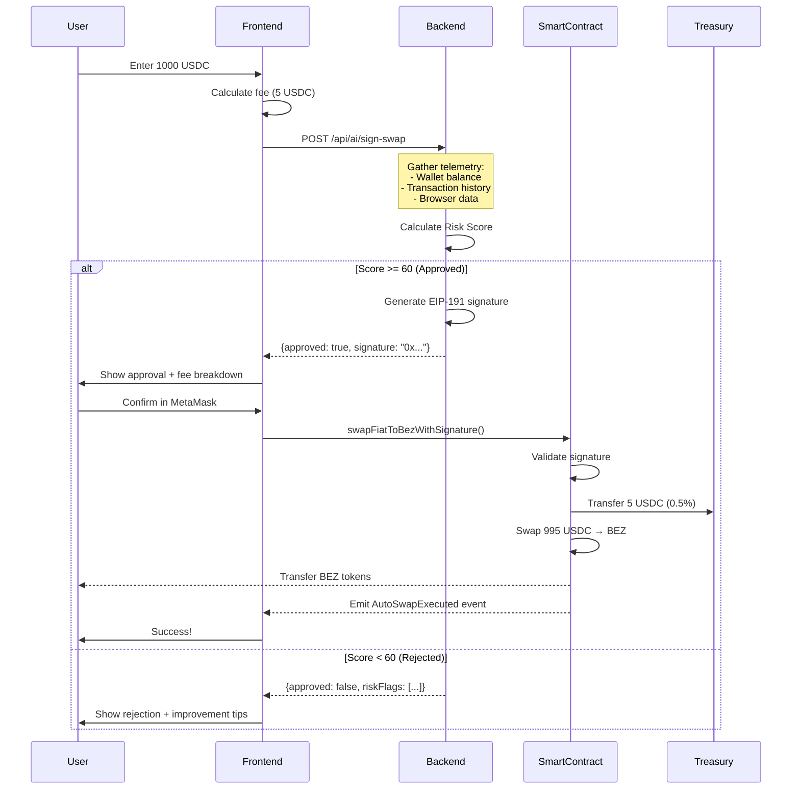

# Revenue Stream Native - Sistema Completo

## 🎯 Resumen Ejecutivo

BeZhas ha implementado un **sistema de ingresos nativo** que genera revenue sostenible para financiar el desarrollo continuo de la plataforma. En lugar de quemar tokens (modelo deflacionario), ahora cobramos una **tarifa del 0.5%** en todas las transacciones de swap, que va directamente a la tesorería de desarrollo.

### Características Principales

- ✅ **Revenue Automático**: 0.5% de fee en cada swap → tesorería
- ✅ **AI Risk Engine**: Prevención de fraude con evaluación de riesgo en tiempo real
- ✅ **Optimización de Gas**: Arquitectura basada en firmas (sin whitelist on-chain)
- ✅ **UX Superior**: Aprobación en un clic (sin esperas de whitelist)
- ✅ **Transparencia**: Todas las fees visibles on-chain
- ✅ **Escalable**: Revenue crece linealmente con el volumen

### Proyección de Ingresos

| Volumen Mensual | Fee (0.5%) | Ingreso Anual |
|----------------|-----------|---------------|
| $100K          | $500/mes  | $6,000        |
| $1M            | $5,000/mes| $60,000       |
| $10M           | $50K/mes  | $600,000      |

---

## 🏗️ Arquitectura del Sistema

### Componentes

```
┌─────────────────────────────────────────────────────────────┐
│                     REVENUE STREAM NATIVE                    │
└─────────────────────────────────────────────────────────────┘

┌──────────────┐         ┌──────────────┐         ┌──────────────┐
│   FRONTEND   │────────▶│   BACKEND    │────────▶│   BLOCKCHAIN │
│              │         │              │         │              │
│ SwapWithAI   │  POST   │ AI Risk      │  Grant  │ BezLiquidity │
│ Component    │  /sign  │ Engine       │  Role   │ Ramp.sol     │
│              │         │              │         │              │
│ - Telemetry  │         │ - Risk Score │         │ - Validate   │
│ - Fee Display│         │ - Signature  │         │ - Collect Fee│
│ - MetaMask   │         │ - Auth       │         │ - Execute    │
└──────────────┘         └──────────────┘         └──────────────┘
       │                        │                        │
       │                        │                        │
       ▼                        ▼                        ▼
  User clicks          Evaluates 7 factors        0.5% → Treasury
  "Buy BEZ"            KYC, VPN, Balance...       95.5% → Swap
                       Returns signature          100% Transparent
```

### Flujo de Transacción



---

## 📁 Archivos Implementados

### 1. Smart Contract: `BezLiquidityRamp.sol`

**Ubicación**: `backend/contracts/BezLiquidityRamp.sol`

**Características**:
- ✅ Revenue system con `platformFeeBps` (50 = 0.5%)
- ✅ Validación de firmas EIP-191 (ECDSA recovery)
- ✅ Anti-replay protection (`executedSignatures` mapping)
- ✅ AccessControl roles (SIGNER_ROLE, TREASURY_MANAGER_ROLE)
- ✅ Statistics tracking (volume, fees, transactions)
- ✅ Emergency functions (pause, recovery)

**Funciones Principales**:

```solidity
// Ejecuta swap con firma del AI Risk Engine
function swapFiatToBezWithSignature(
    uint256 amountStablecoin,    // 1000 USDC
    uint256 minBezAmount,        // Slippage protection
    string memory serviceId,     // "LIQUIDITY_RAMP"
    uint256 deadline,            // Unix timestamp
    bytes memory signature       // EIP-191 signature
) external returns (uint256 bezReceived)

// Calcula fee y monto neto
function getEstimatedBez(
    uint256 amountStablecoin
) external view returns (
    uint256 platformFee,    // 5 USDC
    uint256 netAmount,      // 995 USDC
    uint256 estimatedBez    // ~995 BEZ
)

// Estadísticas del contrato
function getStats() external view returns (
    uint256 totalVolumeProcessed,
    uint256 totalFeesCollected,
    uint256 totalTransactions
)
```

**Seguridad**:
- ✅ ReentrancyGuard en todas las funciones de pago
- ✅ SafeERC20 para transferencias seguras
- ✅ Fee cap máximo del 5% (no se puede aumentar más)
- ✅ Role-based access control
- ✅ Signature deadline (anti-replay temporal)
- ✅ Hash tracking (anti-replay permanente)

### 2. Backend Controller: `aiRiskEngine.controller.js`

**Ubicación**: `backend/controllers/aiRiskEngine.controller.js`

**Características**:
- ✅ Algoritmo de scoring de riesgo (7 factores)
- ✅ Generación de firmas criptográficas (ethers.js v6)
- ✅ Integración con KYC, VPN, Sanctions APIs
- ✅ Rate limiting y timeout handling
- ✅ Logging detallado para auditoría

**Endpoints**:

```javascript
// POST /api/ai/sign-swap
// Evalúa riesgo y retorna firma si aprueba
{
  "telemetry": {...},
  "amountUSDC": 1000,
  "serviceId": "LIQUIDITY_RAMP"
}

Response (Approved):
{
  "approved": true,
  "signature": "0x1234...",
  "deadline": 1735938274,
  "riskScore": 75,
  "riskLevel": "LOW_RISK",
  "riskFlags": ["No VPN detected", "Wallet active"]
}

Response (Rejected):
{
  "approved": false,
  "riskScore": 35,
  "riskLevel": "HIGH_RISK",
  "riskFlags": [
    "KYC not completed",
    "VPN detected",
    "Wallet inactive (0 transactions)",
    "Low balance (< 0.1 MATIC)"
  ],
  "reason": "Risk score below threshold (60)"
}
```

**Algoritmo de Risk Scoring**:

```javascript
Base Score: 100

Deductions:
- No KYC (level 0): -30 points
- Partial KYC (level 1): -10 points
- VPN detected: -10 points
- Wallet inactive (nonce = 0): -20 points
- Low balance (< 0.1 MATIC): -15 points
- Contract address (not EOA): -40 points
- High value (> $10,000): -10 points
- New wallet (< 7 days): -10 points

Approval Threshold: 60/100
```

**Categorías de Riesgo**:
- **HIGH_RISK** (<40): Rechazado automáticamente
- **MEDIUM_RISK** (40-70): Requiere revisión manual o rechazado
- **LOW_RISK** (70-90): Aprobado automáticamente
- **INSTITUTIONAL_LOW** (90+): Usuario verificado/institucional

### 3. Frontend Service: `aiRiskEngine.js`

**Ubicación**: `frontend/src/services/aiRiskEngine.js`

**Funciones Exportadas**:

```javascript
// 1. Recopilar telemetría del usuario
const telemetry = await gatherUserTelemetry(address, provider);
// Returns: { balance, nonce, isContract, userAgent, screen, timezone }

// 2. Solicitar firma del backend
const response = await requestSwapSignature(telemetry, amountUSDC, serviceId);
// Returns: { approved, signature, deadline, riskScore, riskFlags }

// 3. Calcular desglose de fee
const breakdown = calculateNetAmount(1000);
// Returns: { totalAmount: 1000, feeAmount: 5, netAmount: 995, feePercentage: 0.5 }

// 4. Verificar sanctions
const result = await checkAddressSanctions(address);
// Returns: { clean: true/false, lists: [...] }

// 5. Obtener estadísticas del AI Engine
const stats = await getAIEngineStats();
// Returns: { signerAddress, totalApproved, totalRejected, approvalRate }
```

### 4. Frontend Component: `SwapWithAI.jsx`

**Ubicación**: `frontend/src/components/payments/SwapWithAI.jsx`

**Estados del Componente**:

1. **input**: Usuario ingresa monto USDC
2. **telemetry**: Recopilando datos on-chain + browser
3. **evaluating**: AI evaluando riesgo (backend)
4. **approved**: Transacción aprobada, mostrar firma
5. **rejected**: Transacción rechazada, mostrar razones
6. **signing**: Esperando confirmación de MetaMask
7. **success**: Swap completado exitosamente

**Props**:

```javascript
<SwapWithAI
  serviceId="LIQUIDITY_RAMP"  // ID del servicio
  onSuccess={(data) => {
    // data = { txHash, amountUSDC, feeAmount, netAmount }
    console.log('Swap completed!', data.txHash);
  }}
  onError={(error) => {
    // error = { message: "..." }
    console.error('Swap failed:', error.message);
  }}
/>
```

**UI Features**:
- ✅ Fee breakdown en tiempo real
- ✅ Indicador de estado (loading spinners)
- ✅ Risk score con colores (verde/amarillo/rojo)
- ✅ Lista de risk flags (transparencia)
- ✅ Sanctions check automático
- ✅ Responsive design (mobile-first)

### 5. Deployment Script: `deployLiquidityRamp.js`

**Ubicación**: `backend/scripts/deployLiquidityRamp.js`

**Uso**:

```bash
# Desplegar en Polygon Mumbai (testnet)
npx hardhat run scripts/deployLiquidityRamp.js --network mumbai

# Desplegar en Polygon Mainnet
npx hardhat run scripts/deployLiquidityRamp.js --network polygon
```

**Configuración Requerida**:

Antes de desplegar, actualizar estas variables en el script:

```javascript
const BEZ_TOKEN = "0xYourBezTokenAddress";
const TREASURY_ADDRESS = "0xYourTreasuryWalletAddress";
```

**Pasos del Script**:

1. ✅ Valida configuración (addresses, network)
2. ✅ Despliega contrato BezLiquidityRamp
3. ✅ Configura roles (SIGNER_ROLE al backend wallet)
4. ✅ Verifica configuración inicial (fee, treasury)
5. ✅ Verifica en Polygonscan (automático)
6. ✅ Guarda info de deployment en JSON
7. ✅ Muestra instrucciones de siguiente paso

**Output Esperado**:

```
🚀 Starting BezLiquidityRamp deployment...

Deploying with account: 0xYourDeployerAddress
Account balance: 1.5 MATIC

📋 Configuration:
  - DEX Router: 0xa5E0829CaCEd8fFDD4De3c43696c57F7D7A678ff
  - BEZ Token: 0xYourBezTokenAddress
  - Stablecoin (USDC): 0x2791Bca1f2de4661ED88A30C99A7a9449Aa84174
  - Admin: 0xYourDeployerAddress
  - Treasury: 0xYourTreasuryAddress

⏳ Deploying BezLiquidityRamp contract...
✅ BezLiquidityRamp deployed to: 0xNewContractAddress

⚙️  Setting up roles...
✅ Granted SIGNER_ROLE to: 0xYourBackendWalletAddress

📊 Contract Configuration:
  - Platform Fee: 50 BPS ( 0.5 %)
  - Treasury Wallet: 0xYourTreasuryAddress

🎉 DEPLOYMENT COMPLETE!
```

---

## ⚙️ Configuración e Instalación

### 1. Instalar Dependencias

```bash
# Backend
cd backend
npm install ethers@^6.0.0

# Frontend (ya debería estar instalado)
cd frontend
npm install ethers@^6.0.0 axios
```

### 2. Configurar Variables de Entorno

#### Backend `.env`

Copiar template y rellenar valores:

```bash
cp backend/.env.revenue-stream backend/.env
```

**Variables Críticas**:

```env
# Wallet privada del backend (genera con ethers.Wallet.createRandom())
AI_SIGNER_PRIVATE_KEY=0x1234567890abcdef...

# Dirección pública del wallet backend
AI_SIGNER_ADDRESS=0xYourBackendWalletAddress

# Contrato desplegado (obtener de deployment script)
BEZ_LIQUIDITY_RAMP_ADDRESS=0xYourDeployedContractAddress

# RPC de Polygon
POLYGON_RPC_URL=https://polygon-rpc.com

# Parámetros del AI
MIN_RISK_SCORE=60
SIGNATURE_DEADLINE_SECONDS=300
MAX_TRANSACTION_AMOUNT=10000
```

#### Frontend `.env`

```env
# Mismo contrato que en backend
VITE_BEZ_LIQUIDITY_RAMP_ADDRESS=0xYourDeployedContractAddress

# Token addresses
VITE_BEZ_TOKEN_ADDRESS=0xYourBezTokenAddress
VITE_STABLECOIN_ADDRESS=0x2791Bca1f2de4661ED88A30C99A7a9449Aa84174

# Polygon config
VITE_POLYGON_RPC_URL=https://polygon-rpc.com
VITE_CHAIN_ID=137
```

### 3. Desplegar Smart Contract

```bash
# 1. Configurar Hardhat (si no está configurado)
cd backend
npx hardhat init  # Seleccionar TypeScript/JavaScript project

# 2. Instalar OpenZeppelin
npm install @openzeppelin/contracts

# 3. Actualizar addresses en deployLiquidityRamp.js
# - BEZ_TOKEN
# - TREASURY_ADDRESS

# 4. Desplegar en testnet (Mumbai)
npx hardhat run scripts/deployLiquidityRamp.js --network mumbai

# 5. Copiar contract address al .env
# BEZ_LIQUIDITY_RAMP_ADDRESS=0xNewContractAddress
```

### 4. Otorgar SIGNER_ROLE al Backend

Si el script no otorgó el role automáticamente:

```javascript
// En Hardhat console o script
const contract = await ethers.getContractAt(
  "BezLiquidityRamp",
  "0xYourContractAddress"
);

const SIGNER_ROLE = await contract.SIGNER_ROLE();
await contract.grantRole(SIGNER_ROLE, "0xYourBackendWalletAddress");

console.log("SIGNER_ROLE granted!");
```

### 5. Registrar Rutas en Backend

**Ya completado**: Las rutas del AI Risk Engine ya están registradas en `backend/server.js`:

```javascript
const aiRiskEngineRoutes = require('./routes/aiRiskEngine.routes');
app.use('/api/ai', aiRiskEngineRoutes);
```

### 6. Iniciar Servicios

```bash
# Terminal 1: Backend
cd backend
npm run dev  # o npm start

# Terminal 2: Frontend
cd frontend
npm run dev

# Abrir http://localhost:5173
```

---

## 🧪 Testing

### Test Manual - Flujo Completo

1. **Abrir Frontend**: http://localhost:5173
2. **Conectar Wallet**: MetaMask en Polygon Mumbai
3. **Navegar a Swap**: Ir al componente SwapWithAI
4. **Ingresar Monto**: 100 USDC
5. **Verificar Fee**: Debe mostrar 0.5 USDC fee (0.5%)
6. **Click "Continue"**: Inicia evaluación AI
7. **Esperar Aprobación**: Debería aprobar (risk score > 60)
8. **Ver Desglose**: 
   - Amount: 100 USDC
   - Fee: 0.5 USDC
   - Net Swap: 99.5 USDC → BEZ
9. **Click "Execute Swap"**: Abre MetaMask
10. **Confirmar**: Esperar confirmación de transacción
11. **Verificar**:
    - Tokens BEZ recibidos en wallet
    - Fee en treasury wallet (0.5 USDC)
    - Evento `PlatformFeeCollected` en Polygonscan

### Test de Rechazo (High Risk)

Para forzar un rechazo, modificar temporalmente `MIN_RISK_SCORE`:

```env
# backend/.env
MIN_RISK_SCORE=95  # Solo aprueba institutional users
```

Reiniciar backend y probar con wallet nueva (sin KYC, sin historial). Debería rechazar.

### Test de Anti-Replay

Intentar usar la misma firma dos veces:

```javascript
// Frontend console
const tx1 = await contract.swapFiatToBezWithSignature(...signature);
await tx1.wait();  // OK

const tx2 = await contract.swapFiatToBezWithSignature(...signature);
await tx2.wait();  // REVERT: "Signature already used"
```

### Test de Fee Collection

Verificar que el fee llega a treasury:

```javascript
// Hardhat console
const contract = await ethers.getContractAt("BezLiquidityRamp", "0x...");
const usdc = await ethers.getContractAt("IERC20", "0x...");

const treasuryAddress = await contract.treasuryWallet();
const balanceBefore = await usdc.balanceOf(treasuryAddress);

// Ejecutar swap...

const balanceAfter = await usdc.balanceOf(treasuryAddress);
console.log("Fee collected:", balanceAfter - balanceBefore);
// Expected: 0.5% of swap amount
```

---

## 📊 Monitoreo y Analytics

### Dashboard de Revenue

Crear un dashboard que muestre:

```javascript
// Query contract stats
const stats = await contract.getStats();

console.log({
  totalVolume: ethers.formatUnits(stats[0], 6), // USDC (6 decimals)
  totalFeesCollected: ethers.formatUnits(stats[1], 6),
  totalTransactions: stats[2].toString(),
  
  // Calculate metrics
  averageTransactionSize: stats[0] / stats[2],
  effectiveFeeRate: (stats[1] / stats[0]) * 100,  // Should be 0.5%
  
  // Revenue projections
  monthlyRevenue: stats[1],  // If collected this month
  annualProjection: stats[1] * 12
});
```

### Event Monitoring

Escuchar eventos del contrato en tiempo real:

```javascript
// Backend monitoring script
contract.on("PlatformFeeCollected", (user, amount, service, event) => {
  console.log(`💰 Fee collected: ${ethers.formatUnits(amount, 6)} USDC`);
  
  // Send to Discord
  sendDiscordAlert({
    title: "Revenue Collected",
    description: `User: ${user}\nAmount: ${amount} USDC\nService: ${service}`,
    color: 0x00ff00  // Green
  });
});

contract.on("AutoSwapExecuted", (user, amountIn, amountOut, event) => {
  console.log(`✅ Swap executed: ${user}`);
  // Track in database for analytics
});
```

### Dune Analytics Integration

Crear queries en Dune para visualización pública:

```sql
-- Total revenue by day
SELECT 
  DATE_TRUNC('day', evt_block_time) AS date,
  SUM(feeAmount) / 1e6 AS daily_revenue_usdc,
  COUNT(*) AS transactions
FROM bezliquidityramp_polygon.BezLiquidityRamp_evt_PlatformFeeCollected
GROUP BY 1
ORDER BY 1 DESC;

-- Top users by volume
SELECT 
  user,
  SUM(amountIn) / 1e6 AS total_volume_usdc,
  COUNT(*) AS swaps
FROM bezliquidityramp_polygon.BezLiquidityRamp_evt_AutoSwapExecuted
GROUP BY 1
ORDER BY 2 DESC
LIMIT 10;
```

---

## 🔒 Seguridad

### Checklist Pre-Producción

- [ ] **Smart Contract Audit**: Contratar auditor (CertiK, OpenZeppelin)
- [ ] **Private Key Security**: 
  - [ ] Backend wallet en hardware wallet o AWS KMS
  - [ ] Nunca commit AI_SIGNER_PRIVATE_KEY a git
  - [ ] Rotación de keys cada 6 meses
- [ ] **Rate Limiting**:
  - [ ] Máximo 10 requests/min por IP
  - [ ] Máximo 50 swaps/día por wallet
- [ ] **Monitoring**:
  - [ ] Alertas en Discord/Slack para high-risk attempts
  - [ ] Logs de auditoría en base de datos
  - [ ] Uptime monitoring del backend
- [ ] **Smart Contract Verification**:
  - [ ] Código verificado en Polygonscan
  - [ ] README público con documentación
- [ ] **Emergency Procedures**:
  - [ ] Procedimiento de pausa del contrato
  - [ ] Procedimiento de revocación de SIGNER_ROLE
  - [ ] Plan de respuesta a incidentes

### Amenazas y Mitigaciones

| Amenaza | Mitigación |
|---------|-----------|
| **Signature Replay** | ✅ Hash tracking + deadline expiration |
| **Frontend Bypass** | ✅ Backend valida todas las firmas |
| **High-Risk Users** | ✅ AI scoring con threshold |
| **DOS Attack** | ✅ Rate limiting + gas limit |
| **Private Key Leak** | ✅ Role revocation + emergency pause |
| **Smart Contract Bug** | ✅ OpenZeppelin libraries + audit |
| **Fee Manipulation** | ✅ Fee cap at 5% + role-based access |

---

## 🚀 Próximos Pasos

### Fase 1: Testing (1-2 semanas)
- [ ] Deploy en Mumbai testnet
- [ ] Test completo del flujo
- [ ] Test de edge cases (replay, high risk, etc.)
- [ ] Fix bugs encontrados

### Fase 2: Security (2-3 semanas)
- [ ] Contratar audit del smart contract
- [ ] Implementar recomendaciones del audit
- [ ] Penetration testing del backend
- [ ] Setup monitoring y alertas

### Fase 3: Production (1 semana)
- [ ] Deploy en Polygon mainnet
- [ ] Configurar wallets de producción
- [ ] Setup Dune Analytics dashboards
- [ ] Anuncio público del sistema

### Fase 4: Optimización (Ongoing)
- [ ] Analizar datos de revenue
- [ ] Optimizar risk scoring basado en data
- [ ] A/B testing de fee percentages
- [ ] Integrar más servicios (no solo swaps)

---

## 📞 Soporte

### Documentación Adicional

- **Smart Contract**: Ver comentarios en `BezLiquidityRamp.sol`
- **Backend API**: Ver JSDoc en `aiRiskEngine.controller.js`
- **Frontend**: Ver PropTypes en `SwapWithAI.jsx`

### Contacto

- **GitHub Issues**: Para reportar bugs
- **Discord**: Canal #dev-support para preguntas
- **Email**: dev@bezhas.com para temas urgentes

### Links Útiles

- **Polygonscan**: https://polygonscan.com/address/{CONTRACT_ADDRESS}
- **OpenZeppelin Docs**: https://docs.openzeppelin.com/contracts
- **Ethers.js Docs**: https://docs.ethers.org/v6/
- **EIP-191**: https://eips.ethereum.org/EIPS/eip-191

---

## 📈 Métricas de Éxito

### KPIs a Monitorear

1. **Revenue Metrics**:
   - Total fees collected (USDC)
   - Monthly recurring revenue (MRR)
   - Average transaction size
   - Fee collection rate (should be 0.5%)

2. **User Metrics**:
   - Total swaps executed
   - Unique users
   - Repeat user rate
   - Average swaps per user

3. **AI Performance**:
   - Approval rate (target: 85-90%)
   - Rejection rate (target: 10-15%)
   - False positive rate (approved but fraudulent)
   - False negative rate (rejected but legitimate)

4. **Technical Metrics**:
   - Backend API latency (target: <500ms)
   - Smart contract gas costs (target: <100k gas)
   - Uptime (target: 99.9%)
   - Error rate (target: <0.1%)

### Objetivos Q1 2024

- **Revenue**: $5,000/month ($60K/year)
- **Volume**: $1M/month processed
- **Users**: 500 unique users
- **Swaps**: 1,000 transactions
- **AI Accuracy**: 90% approval rate, <1% fraud

---

**Sistema implementado por**: GitHub Copilot  
**Fecha**: Enero 2024  
**Versión**: 1.0.0  

*¡La plataforma ahora gana dinero por sus servicios para poder seguir desarrollando! 🚀*
