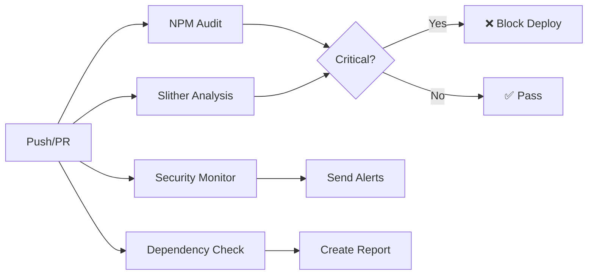
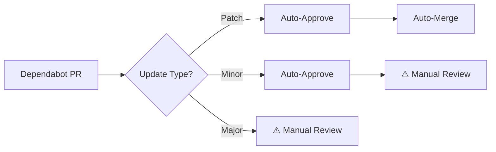

# 🔒 BeZhas Security & Dependency Management System

## Overview

Sistema automatizado de monitoreo de seguridad y gestión de dependencias para BeZhas Web3 Platform.

**🚀 NUEVO: Security Sentinel con monitoreo continuo cada 12 horas**

## 📚 Quick Links

- **[ACTIVATION_GUIDE.md](./ACTIVATION_GUIDE.md)** - Guía paso a paso para activar el sistema ⭐ EMPIEZA AQUÍ
- **[DISCORD_WEBHOOK_SETUP.md](./DISCORD_WEBHOOK_SETUP.md)** - Configuración de Discord
- **[DEVOPS_IMPLEMENTATION_SUMMARY.md](./DEVOPS_IMPLEMENTATION_SUMMARY.md)** - Resumen técnico

## 🎯 Features

### 1. **Automated Security Audits**
- ✅ NPM vulnerability scanning (frontend + backend)
- ✅ Solidity smart contract analysis with Slither
- ✅ GitHub CodeQL integration
- ✅ ESLint security rules
- ✅ Dependency version monitoring

### 2. **Real-Time Alerts (NEW)**
- 🔔 Discord webhook notifications
- 📱 Telegram bot alerts
- 📧 GitHub Issues creation
- 🚨 Critical/High severity filtering
- ⏰ Cron scheduler every 12 hours

### 3. **Automated Dependency Updates**
- 🤖 Dependabot integration (daily checks)
- 🔄 Auto-merge for patch updates
- ⚠️  Manual review for major versions
- 📊 Detailed update reports

### 4. **CVE & Advisory Monitoring**
- 🔍 GitHub Security Advisories API
- 📰 Real-time vulnerability tracking
- 🎯 Tech stack-specific filtering (React, Solidity, Node.js, Ethers.js)

---

## 📁 File Structure

```
bezhas-web3/
├── .github/
│   ├── workflows/
│   │   ├── security-audit.yml          # Main security workflow
│   │   └── dependabot-auto-merge.yml   # Auto-merge safe updates
│   └── dependabot.yml                  # Dependabot configuration
├── scripts/
│   ├── securityMonitor.js              # CVE monitoring script
│   ├── dependencyUpdater.js            # Dependency checker
│   ├── package.json                    # Scripts dependencies
│   └── reports/                        # Generated reports
└── SECURITY_SYSTEM_README.md           # This file
```

---

## 🚀 Quick Start

### Prerequisites

1. **GitHub Secrets** (Required)
   ```bash
   # Repository Settings > Secrets and Variables > Actions
   GITHUB_TOKEN              # Auto-provided by GitHub Actions
   DISCORD_SECURITY_WEBHOOK  # Discord webhook URL for alerts
   TELEGRAM_BOT_TOKEN        # Telegram bot token (optional)
   TELEGRAM_SECURITY_CHAT_ID # Telegram chat ID (optional)
   ```

2. **Local Environment Setup**
   ```bash
   # Root .env file
   DISCORD_WEBHOOK_URL="https://discord.gg/wrGJzP7tr"
   
   # Backend .env file
   DISCORD_WEBHOOK_URL=https://discord.gg/wrGJzP7tr
   
   # Scripts .env file (already configured)
   DISCORD_WEBHOOK_URL=https://discord.gg/wrGJzP7tr
   ```

3. **Enable GitHub Features**
   - Settings > Security > Code security and analysis
   - Enable: Dependabot alerts, Dependabot security updates, CodeQL analysis

4. **Discord Webhook Setup** (if using custom webhook)
   - Go to Discord Server Settings
   - Integrations > Webhooks > New Webhook
   - Copy webhook URL
   - Add to GitHub Secrets as `DISCORD_SECURITY_WEBHOOK`

### Installation

```bash
# Install script dependencies
cd scripts
npm install

# Configure Discord webhook (REQUIRED)
# See detailed guide: DISCORD_WEBHOOK_SETUP.md
# Quick steps:
# 1. Join Discord: https://discord.gg/wrGJzP7tr
# 2. Create webhook in Server Settings > Integrations > Webhooks
# 3. Copy webhook URL to .env files

# Test Discord connection
npm run test-discord

# Test security monitor locally
node securityMonitor.js

# Test dependency checker
node dependencyUpdater.js --workspace=frontend
```

---

## 🔧 Configuration

### 1. Security Monitor (`securityMonitor.js`)

Edit configuration in the file:

```javascript
const CONFIG = {
    // Packages to monitor
    CRITICAL_PACKAGES: [
        'react', 'ethers', 'wagmi', 'express', 'mongoose'
    ],
    
    // Alert on these severities
    ALERT_SEVERITIES: ['CRITICAL', 'HIGH'],
    
    // Solidity keywords
    SOLIDITY_KEYWORDS: ['solidity', 'smart contract', 'ethereum']
};
```

### 2. Dependabot (`dependabot.yml`)

Already configured for:
- Weekly scans (Mondays 3 AM UTC)
- Grouped updates by ecosystem
- Auto-reviewers assignment
- Semantic commit messages

### 3. GitHub Actions Workflow

Triggers:
- ✅ Every push to `main` or `develop`
- ✅ Pull requests
- ✅ Daily scheduled scan (2 AM UTC)
- ✅ Manual workflow dispatch

---

## 📊 Workflows

### Security Audit Pipeline



### Auto-Update Flow



---

## 🎯 Usage Examples

### 1. Run Security Scan Manually

```bash
# Trigger workflow from GitHub UI
Actions > Security Audit > Run workflow

# Or via GitHub CLI
gh workflow run security-audit.yml
```

### 2. Check Specific Workspace

```bash
cd scripts
node dependencyUpdater.js --workspace=backend
```

### 3. Test Discord Alert

```bash
export DISCORD_WEBHOOK_URL="https://discord.com/api/webhooks/..."
node securityMonitor.js
```

### 4. Generate Security Report

```bash
# Reports saved to scripts/reports/
npm run full-audit
```

---

## 🔔 Alert Formats

### Discord Embed

```
🚨 Security Advisory: GHSA-xxxx-xxxx-xxxx
━━━━━━━━━━━━━━━━━━━━━━━━━━━━━━━━━━
Summary: Critical XSS vulnerability in react-dom

Severity: CRITICAL
CVSS Score: 9.8
Published: 2025-01-15

Affected Packages:
• react-dom (>=16.0.0 <18.2.1)

Patched Version: 18.2.1

[View Details]
```

### Telegram Message

```
🚨 *Security Advisory Detected*

*Advisory ID:* GHSA-xxxx-xxxx-xxxx
*Severity:* CRITICAL
*CVSS Score:* 9.8

*Summary:*
Critical XSS vulnerability in react-dom

*Affected Packages:*
• react-dom (>=16.0.0 <18.2.1)

*Patched Version:* 18.2.1

*Published:* 2025-01-15

[View Details](https://github.com/advisories/GHSA-xxxx)
```

---

## 📈 Monitoring Dashboard

### Key Metrics

| Metric | Location | Frequency |
|--------|----------|-----------|
| NPM Vulnerabilities | GitHub Actions Summary | Every push |
| Slither Findings | Artifacts > `slither-report.json` | Every push |
| Outdated Dependencies | Artifacts > `outdated-dependencies` | Daily |
| Security Advisories | `scripts/security-report.json` | Daily |

### Accessing Reports

```bash
# Download latest artifacts
gh run download <run-id>

# View in browser
open https://github.com/<owner>/<repo>/actions/runs/<run-id>
```

---

## 🛡️ Security Policies

### Vulnerability Response

| Severity | Action | Timeline |
|----------|--------|----------|
| **Critical** | Block deployment + Immediate alert | < 24 hours |
| **High** | Alert + Manual review required | < 7 days |
| **Moderate** | Scheduled update | < 30 days |
| **Low** | Next release cycle | < 90 days |

### Update Strategy

```javascript
AUTO_UPDATE_PATCH: true   // 1.0.0 → 1.0.1 ✅ Auto-merge
AUTO_UPDATE_MINOR: false  // 1.0.0 → 1.1.0 ⚠️ Review required
AUTO_UPDATE_MAJOR: false  // 1.0.0 → 2.0.0 ⚠️ Review required
```

---

## 🔍 Troubleshooting

### Common Issues

**1. Workflow Fails with "GraphQL Error"**
```bash
# Ensure GITHUB_TOKEN has correct permissions
# Settings > Actions > General > Workflow permissions
# Enable: "Read and write permissions"
```

**2. No Alerts Received**
```bash
# Verify webhook URLs
echo $DISCORD_SECURITY_WEBHOOK
echo $TELEGRAM_BOT_TOKEN

# Test webhooks manually
curl -X POST $DISCORD_SECURITY_WEBHOOK \
  -H "Content-Type: application/json" \
  -d '{"content":"Test alert"}'
```

**3. Slither Not Running**
```bash
# Check if contracts directory exists
ls -la contracts/

# Install Slither locally
pip install slither-analyzer
slither . --json slither-report.json
```

---

## 📚 References

- [GitHub Security Advisories API](https://docs.github.com/en/graphql/reference/objects#securityadvisory)
- [Dependabot Documentation](https://docs.github.com/en/code-security/dependabot)
- [Slither Security Tool](https://github.com/crytic/slither)
- [NPM Audit](https://docs.npmjs.com/cli/v9/commands/npm-audit)
- [CodeQL](https://codeql.github.com/)

---

## 🤝 Contributing

To add new security checks:

1. Create new job in `security-audit.yml`
2. Add corresponding script in `scripts/`
3. Update this README with usage instructions
4. Test with `workflow_dispatch` before enabling auto-trigger

---

## 📝 License

MIT License - See LICENSE file for details

---

## 👥 Security Team

- **Lead:** DevSecOps Engineer
- **Alerts:** Discord #security-alerts channel
- **Issues:** GitHub Security tab
- **Contact:** security@bezhas.io

---

**Last Updated:** 2025-01-09  
**Version:** 1.0.0  
**Status:** ✅ Active
