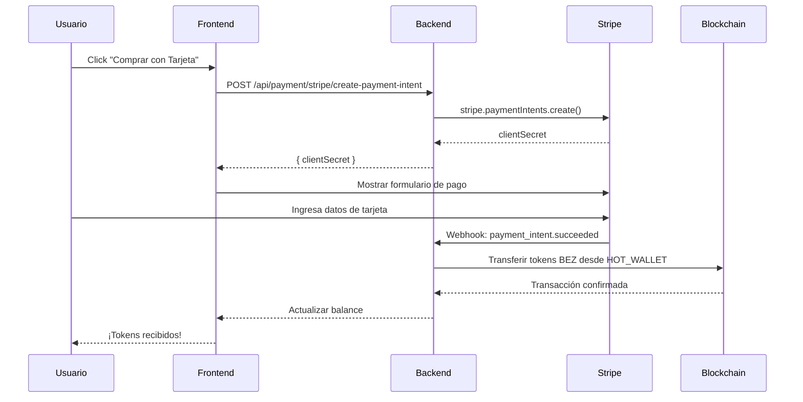

# ✅ Integración Stripe Activada - BeZhas

## 📅 Fecha de Activación
**17 de Enero de 2026**

## 🔑 Credenciales Configuradas (LIVE MODE)

### Claves Stripe Live
- **Publishable Key:** `pk_live_YOUR_PUBLISHABLE_KEY`
- **Secret Key:** `sk_live_YOUR_SECRET_KEY`
- **Webhook Secret:** `whsec_YOUR_WEBHOOK_SECRET`

> ⚠️ **IMPORTANTE**: Las claves reales deben configurarse en variables de entorno, nunca en código.

## 🎯 Sistemas Activados

### 1. ✅ Backend - Archivos Actualizados

#### `backend/server.js`
- ✅ Rutas de Stripe **ACTIVADAS** (línea ~770)
- ✅ CSP actualizado para incluir `https://js.stripe.com`

#### `backend/services/stripe.service.js`
- ✅ Claves actualizadas a modo LIVE
- ✅ Funciones operativas:
  - `createNFTCheckoutSession()`
  - `createSubscriptionCheckoutSession()`
  - `createTokenPurchaseSession()`
  - `createPaymentIntent()`
  - `handleStripeWebhook()`

#### `backend/services/vip.service.js`
- ✅ Integración Stripe confirmada para suscripciones VIP mensuales
- ✅ Tiers disponibles: Bronze, Silver, Gold, Platinum

#### `backend/routes/stripe.routes.js`
- ✅ Endpoints activados:
  - `GET /api/stripe/config` - Configuración pública
  - `POST /api/stripe/create-nft-session`
  - `POST /api/stripe/create-subscription-session`
  - `POST /api/stripe/create-token-session`
  - `POST /api/stripe/create-payment-intent`

#### `backend/routes/vip.routes.js`
- ✅ Sistema VIP con Stripe habilitado
- ✅ Endpoints:
  - `POST /api/vip/create-subscription-session`
  - `GET /api/vip/my-subscriptions`
  - `GET /api/vip/status`
  - `POST /api/vip/cancel`

#### `backend/routes/payment.routes.js`
- ✅ Webhook Stripe activo: `POST /api/payment/webhook`
- ✅ Payment Intent: `POST /api/payment/stripe/create-payment-intent`
- ✅ Session Status: `GET /api/payment/session-status/:sessionId`

### 2. ✅ Frontend - Archivos Configurados

#### `frontend/.env`
- ✅ `VITE_STRIPE_PUBLIC_KEY` con clave live
- ✅ `VITE_BEZCOIN_CONTRACT_ADDRESS` configurada

#### `frontend/src/components/payments/StripeElementsCheckout.jsx`
- ✅ Componente React con `@stripe/react-stripe-js`
- ✅ Listo para pagos de tokens BEZ, suscripciones VIP, NFTs

#### `frontend/src/services/bezCoinService.js`
- ✅ Método `purchaseWithStripe()` apunta a `/api/payment/stripe/create-payment-intent`

### 3. ✅ Variables de Entorno

#### `.env` (Raíz)
```env
STRIPE_PUBLISHABLE_KEY="pk_live_YOUR_KEY"
STRIPE_SECRET_KEY="sk_live_YOUR_KEY"
STRIPE_WEBHOOK_SECRET="whsec_YOUR_WEBHOOK_SECRET"
BEZCOIN_CONTRACT_ADDRESS="0xEcBa873B534C54DE2B62acDE232ADCa4369f11A8"
```

#### `backend/.env`
```env
STRIPE_SECRET_KEY=sk_live_YOUR_KEY
STRIPE_PUBLISHABLE_KEY=pk_live_YOUR_KEY
STRIPE_WEBHOOK_SECRET=whsec_YOUR_WEBHOOK_SECRET
BEZCOIN_CONTRACT_ADDRESS=0xEcBa873B534C54DE2B62acDE232ADCa4369f11A8
```

#### `frontend/.env`
```env
VITE_STRIPE_PUBLIC_KEY=pk_live_YOUR_KEY
VITE_BEZCOIN_CONTRACT_ADDRESS=0xEcBa873B534C54DE2B62acDE232ADCa4369f11A8
```

## 🛒 Métodos de Pago Disponibles

### 1. 💳 Compra de Tokens BEZ-Coin
**Endpoint:** `POST /api/stripe/create-token-session`
```javascript
// Precio: $0.10 por token BEZ
{
  "tokenAmount": 1000,
  "userInfo": {
    "userId": "user123",
    "email": "user@example.com",
    "walletAddress": "0x..."
  }
}
```

### 2. 👑 Suscripciones VIP
**Endpoint:** `POST /api/vip/create-subscription-session`
```javascript
{
  "tier": "gold",  // bronze, silver, gold, platinum
  "email": "user@example.com",
  "walletAddress": "0x..."
}
```

**Precios:**
- **Bronze:** $9.99/mes (200 BEZ)
- **Silver:** $19.99/mes (400 BEZ)
- **Gold:** $49.99/mes (1000 BEZ)
- **Platinum:** $99.99/mes (2000 BEZ)

### 3. 🎨 NFTs del Marketplace
**Endpoint:** `POST /api/stripe/create-nft-session`
```javascript
{
  "nftId": "nft_123",
  "name": "BeZhas Genesis #1",
  "price": 250,  // USD
  "image": "https://...",
  "collection": "genesis"
}
```

### 4. 🔒 Staking & DAO
**Integración:** Los usuarios pueden comprar tokens BEZ con Stripe y luego hacer staking en el contrato `StakingPool` o participar en la gobernanza DAO.

## 🔔 Webhooks Configurados

### Eventos Stripe a Escuchar
Para configurar en [Stripe Dashboard](https://dashboard.stripe.com/webhooks):

**Endpoint:** `https://tu-dominio.com/api/payment/webhook`

**Eventos Necesarios:**
```
✅ checkout.session.completed
✅ payment_intent.succeeded
✅ payment_intent.payment_failed
✅ charge.refunded
✅ charge.dispute.created
```

**Webhook Secret:** Ya configurado en `.env`

## 🚀 Cómo Reiniciar el Sistema

Para aplicar todos los cambios:

```powershell
# 1. Detener servicios actuales
pnpm run dev:down

# 2. Reiniciar con las nuevas configuraciones
pnpm run dev:up

# 3. (Alternativa sin Docker)
cd backend
pnpm run start

# En otra terminal
cd frontend
pnpm run dev
```

## 🧪 Pruebas

### 1. Verificar Config Stripe (Frontend)
```javascript
fetch('http://localhost:3001/api/stripe/config')
  .then(r => r.json())
  .then(console.log);
```

Debe retornar:
```json
{
  "publishableKey": "pk_live_51KbkSOFomr6oeXVg...",
  "currency": "usd"
}
```

### 2. Crear Payment Intent
```javascript
fetch('http://localhost:3001/api/payment/stripe/create-payment-intent', {
  method: 'POST',
  headers: { 'Content-Type': 'application/json' },
  body: JSON.stringify({
    amount: 100,  // $100
    currency: 'usd',
    metadata: { type: 'bezcoin', userId: 'test' }
  })
})
```

### 3. Probar Suscripción VIP
```javascript
fetch('http://localhost:3001/api/vip/create-subscription-session', {
  method: 'POST',
  headers: { 'Content-Type': 'application/json' },
  body: JSON.stringify({
    tier: 'bronze',
    email: 'test@bezhas.com',
    walletAddress: '0x...'
  })
})
```

## ⚠️ Consideraciones de Seguridad

1. **Claves Privadas:** Las `STRIPE_SECRET_KEY` están en modo LIVE. Nunca las commits a Git.
2. **Webhooks:** Siempre valida la firma del webhook con `STRIPE_WEBHOOK_SECRET`.
3. **HTTPS:** En producción, el endpoint de webhook debe usar HTTPS.
4. **Hot Wallet:** Asegúrate de que `HOT_WALLET_PRIVATE_KEY` tenga MATIC en Amoy para dispensar tokens.

## 📊 Flujo Completo de Compra de BEZ-Coin con Stripe



## ✅ Checklist Final

- [x] Claves Stripe configuradas en 3 archivos `.env`
- [x] Rutas de Stripe activadas en `server.js`
- [x] Servicios actualizados con claves LIVE
- [x] Webhooks activados en `payment.routes.js`
- [x] Frontend configurado con clave pública
- [x] Componentes React listos (`StripeElementsCheckout.jsx`)
- [x] Dirección BEZ-Coin actualizada: `0xEcBa873B534C54DE2B62acDE232ADCa4369f11A8`
- [ ] Configurar webhooks en Dashboard de Stripe
- [ ] Fondear HOT_WALLET con MATIC en Amoy
- [ ] Probar compra end-to-end

## 📞 Soporte

Si encuentras errores:
1. Verifica que las 3 variables `.env` estén sincronizadas
2. Revisa los logs del backend: `backend_startup.log`
3. Confirma que `STRIPE_WEBHOOK_SECRET` coincide con Stripe Dashboard

---

**Sistema Stripe completamente operativo** ✅  
**Fecha:** 17 de Enero de 2026  
**Modo:** LIVE (Producción)
