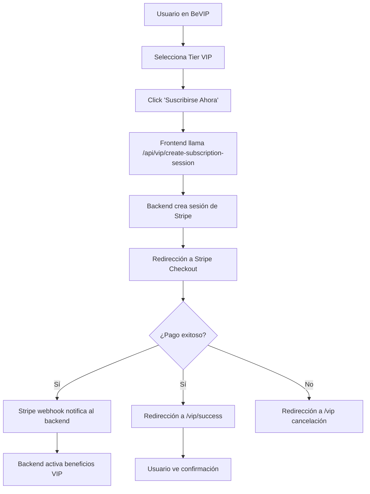

# 🔄 BeZhas VIP - Sistema de Suscripciones Recurrentes

## 📋 Resumen Ejecutivo

Sistema completo de suscripciones VIP mensuales con pagos recurrentes automáticos mediante Stripe. Los usuarios pueden suscribirse a diferentes niveles de membresía y recibir beneficios exclusivos con renovación automática cada mes.

---

## 🎯 Características Implementadas

### ✅ Backend
- **Servicio VIP** (`backend/services/vip.service.js`)
  - Creación de productos y precios en Stripe
  - Gestión de sesiones de checkout recurrentes
  - Verificación de estado VIP
  - Actualización y cancelación de suscripciones
  - Handler de webhooks para eventos de Stripe

- **Rutas API** (`backend/routes/vip.routes.js`)
  - `POST /api/vip/create-subscription-session` - Crear sesión de pago
  - `GET /api/vip/my-subscriptions` - Ver suscripciones activas
  - `GET /api/vip/status` - Verificar estado VIP
  - `GET /api/vip/verify-session/:sessionId` - Verificar sesión después del pago
  - `POST /api/vip/cancel-subscription` - Cancelar suscripción
  - `POST /api/vip/upgrade-subscription` - Cambiar de tier
  - `GET /api/vip/tiers` - Obtener información de tiers
  - `POST /api/vip/webhook/stripe` - Webhook de Stripe

### ✅ Frontend
- **Página BeVIP** (`frontend/src/pages/BeVIP.jsx`)
  - Vista de suscripciones mensuales y paquetes de tokens
  - Integración con Stripe Checkout
  - Redirección automática a página de pago

- **Página de Éxito** (`frontend/src/pages/VIPSuccess.jsx`)
  - Confirmación de suscripción
  - Mostrar detalles del tier activado
  - Información de próxima renovación

### ✅ Configuración
- Variables de entorno configuradas en `.env`
- Claves de Stripe agregadas (test mode)
- Rutas del frontend configuradas en `App.jsx`

---

## 🏆 Tiers VIP Disponibles

| Tier | Precio Mensual | BEZ Equivalente | Beneficios Principales |
|------|---------------|-----------------|------------------------|
| **Bronze** | $9.99 | 200 BEZ | 5% descuento, Badge NFT, Soporte prioritario |
| **Silver** | $19.99 | 400 BEZ | 10% descuento, Soporte 24/7, 10% bonus BEZ |
| **Gold** | $49.99 | 1000 BEZ | 15% descuento, Envío gratis, NFT mensual |
| **Platinum** | $99.99 | 2000 BEZ | 20% descuento, Concierge 24/7, 50% bonus BEZ |

---

## 🔄 Flujo de Suscripción



---

## 🛠️ Configuración de Stripe

### 1. Variables de Entorno Backend (`.env`)

```bash
STRIPE_SECRET_KEY=sk_test_YOUR_TEST_SECRET_KEY_HERE
STRIPE_PUBLISHABLE_KEY=pk_test_YOUR_TEST_PUBLISHABLE_KEY_HERE
STRIPE_WEBHOOK_SECRET=whsec_YOUR_WEBHOOK_SECRET_HERE
FRONTEND_URL=http://localhost:5173
```

### 2. Variables de Entorno Frontend (`frontend/.env`)

```bash
VITE_STRIPE_PUBLIC_KEY=pk_test_YOUR_PUBLISHABLE_KEY_HERE
```

### 3. Configurar Webhook en Stripe Dashboard

1. Ir a: https://dashboard.stripe.com/webhooks
2. Crear endpoint: `http://localhost:3001/api/vip/webhook/stripe` (dev) o `https://tu-dominio.com/api/vip/webhook/stripe` (prod)
3. Seleccionar eventos:
   - `customer.subscription.created`
   - `customer.subscription.updated`
   - `customer.subscription.deleted`
   - `invoice.payment_succeeded`
   - `invoice.payment_failed`
4. Copiar el "Signing secret" y agregarlo a `STRIPE_WEBHOOK_SECRET`

---

## 📡 Endpoints API

### Crear Sesión de Suscripción
```bash
POST /api/vip/create-subscription-session
Authorization: Bearer <token>

Body:
{
  "tier": "silver"  // bronze, silver, gold, platinum
}

Response:
{
  "success": true,
  "sessionId": "cs_test_...",
  "url": "https://checkout.stripe.com/...",
  "tier": "Silver VIP",
  "price": 19.99
}
```

### Verificar Estado VIP
```bash
GET /api/vip/status
Authorization: Bearer <token>

Response:
{
  "success": true,
  "hasVIP": true,
  "tier": "silver",
  "subscriptionId": "sub_...",
  "currentPeriodEnd": "2024-02-15T00:00:00.000Z",
  "cancelAtPeriodEnd": false
}
```

### Ver Suscripciones
```bash
GET /api/vip/my-subscriptions
Authorization: Bearer <token>

Response:
{
  "success": true,
  "subscriptions": [
    {
      "id": "sub_...",
      "tier": "silver",
      "status": "active",
      "currentPeriodEnd": "2024-02-15T00:00:00.000Z",
      "cancelAtPeriodEnd": false,
      "created": "2024-01-15T00:00:00.000Z"
    }
  ]
}
```

### Cancelar Suscripción
```bash
POST /api/vip/cancel-subscription
Authorization: Bearer <token>

Body:
{
  "subscriptionId": "sub_...",
  "immediate": false  // false = cancela al fin del periodo, true = inmediato
}

Response:
{
  "success": true,
  "message": "Subscription will cancel at period end",
  "subscription": {
    "id": "sub_...",
    "status": "active",
    "cancelAtPeriodEnd": true,
    "currentPeriodEnd": "2024-02-15T00:00:00.000Z"
  }
}
```

### Actualizar Tier (Upgrade/Downgrade)
```bash
POST /api/vip/upgrade-subscription
Authorization: Bearer <token>

Body:
{
  "subscriptionId": "sub_...",
  "newTier": "gold"
}

Response:
{
  "success": true,
  "message": "Subscription upgraded successfully",
  "subscription": {
    "id": "sub_...",
    "tier": "gold",
    "status": "active",
    "currentPeriodEnd": "2024-02-15T00:00:00.000Z"
  }
}
```

---

## 🔔 Webhooks de Stripe

Los siguientes eventos son manejados automáticamente:

- **`customer.subscription.created`**: Nueva suscripción creada
  - Activa beneficios VIP en la base de datos
  - Envía NFT Badge del tier correspondiente

- **`customer.subscription.updated`**: Suscripción actualizada
  - Actualiza tier en la base de datos
  - Sincroniza cambios de plan

- **`customer.subscription.deleted`**: Suscripción cancelada
  - Desactiva beneficios VIP
  - Revoca accesos premium

- **`invoice.payment_succeeded`**: Pago mensual exitoso
  - Extiende periodo de suscripción
  - Registra transacción

- **`invoice.payment_failed`**: Pago mensual fallido
  - Notifica al usuario
  - Intenta reintentar pago
  - Suspende acceso si falla múltiples veces

---

## 🧪 Testing

### Tarjetas de Prueba de Stripe

| Número | Resultado | Uso |
|--------|-----------|-----|
| `4242 4242 4242 4242` | ✅ Success | Pago exitoso |
| `4000 0000 0000 0002` | ❌ Decline | Tarjeta declinada |
| `4000 0025 0000 3155` | 🔐 3D Secure | Autenticación requerida |

Fecha: Cualquier fecha futura  
CVC: Cualquier 3 dígitos  
ZIP: Cualquier código postal

### Flujo de Testing

1. Iniciar backend: `pnpm run start:backend`
2. Iniciar frontend: `pnpm run dev` (en carpeta frontend)
3. Navegar a: http://localhost:5173/vip
4. Conectar wallet
5. Seleccionar tier VIP
6. Click "Suscribirse Ahora"
7. Usar tarjeta de prueba `4242 4242 4242 4242`
8. Completar pago
9. Verificar redirección a `/vip/success`

---

## 📊 Base de Datos

Aunque actualmente las suscripciones se consultan directamente desde Stripe, se recomienda crear un modelo en MongoDB para cachear datos:

```javascript
// models/VIPSubscription.model.js (sugerido)
const VIPSubscriptionSchema = new Schema({
    userId: { type: Schema.Types.ObjectId, ref: 'User', required: true },
    stripeSubscriptionId: { type: String, required: true, unique: true },
    stripeCustomerId: String,
    tier: { 
        type: String, 
        enum: ['bronze', 'silver', 'gold', 'platinum'],
        required: true 
    },
    status: {
        type: String,
        enum: ['active', 'canceled', 'past_due', 'unpaid'],
        default: 'active'
    },
    currentPeriodStart: Date,
    currentPeriodEnd: Date,
    cancelAtPeriodEnd: { type: Boolean, default: false },
    nftBadgeId: String,
    created: { type: Date, default: Date.now },
    updated: { type: Date, default: Date.now }
});
```

---

## 🚀 Despliegue en Producción

### Checklist Pre-Producción

- [ ] Cambiar claves de Stripe de **test** a **live**
  - `STRIPE_SECRET_KEY=sk_live_...`
  - `STRIPE_PUBLISHABLE_KEY=pk_live_...`
  - `VITE_STRIPE_PUBLIC_KEY=pk_live_...`

- [ ] Configurar webhook de producción
  - URL: `https://bezhas.com/api/vip/webhook/stripe`
  - Eventos: Ver lista arriba
  - Actualizar `STRIPE_WEBHOOK_SECRET`

- [ ] Actualizar `FRONTEND_URL` en `.env`
  - `FRONTEND_URL=https://bezhas.com`

- [ ] Verificar SSL/HTTPS habilitado

- [ ] Configurar límites de rate limiting en nginx/servidor

- [ ] Habilitar logging de transacciones

- [ ] Configurar alertas de Discord/Slack para pagos fallidos

---

## 🔒 Seguridad

- ✅ Las claves secretas de Stripe nunca se exponen al frontend
- ✅ Webhook signature verification habilitado
- ✅ Autenticación JWT requerida para todos los endpoints (excepto webhook)
- ✅ Metadata de Stripe incluye `userId` y `walletAddress` para trazabilidad
- ✅ Stripe maneja el almacenamiento seguro de información de tarjetas (PCI DSS compliant)

---

## 📞 Soporte

### Documentación Adicional
- [Documentación de Stripe Subscriptions](https://stripe.com/docs/billing/subscriptions/overview)
- [Stripe Webhooks](https://stripe.com/docs/webhooks)
- [Stripe Testing](https://stripe.com/docs/testing)

### Dashboard de Stripe
- Test mode: https://dashboard.stripe.com/test/dashboard
- Live mode: https://dashboard.stripe.com/dashboard

---

## 🎉 Estado Actual

**✅ SISTEMA COMPLETAMENTE FUNCIONAL**

- Backend API implementada
- Frontend integrado con Stripe Checkout
- Webhooks configurados (pendiente URL de producción)
- Páginas de éxito y error creadas
- Rutas del frontend actualizadas
- Variables de entorno configuradas

**Próximos Pasos:**
1. Configurar webhook real de Stripe (cuando el backend esté en producción)
2. Implementar base de datos MongoDB para cachear suscripciones
3. Agregar página de gestión de suscripciones en Dashboard
4. Implementar entrega de NFT Badges al activar VIP
5. Agregar métricas y analytics de suscripciones

---

**Desarrollado por:** BeZhas Team  
**Fecha:** Enero 2024  
**Versión:** 1.0.0
