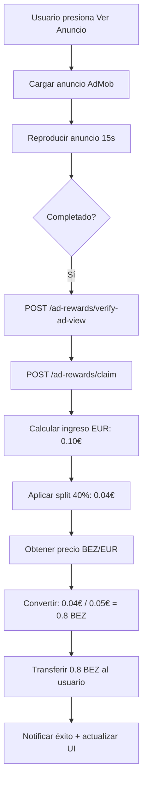
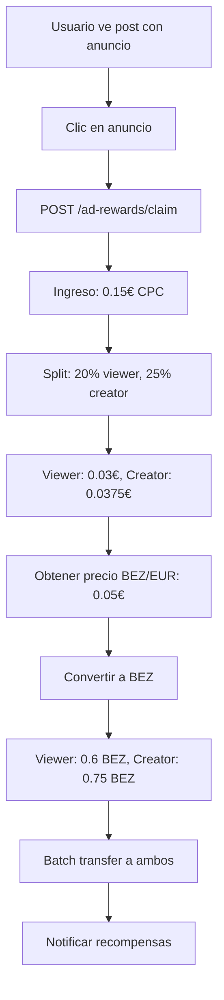

# Watch-to-Earn System - BeZhas Platform

## 🎯 Objetivo

Sistema completo de recompensas "Watch-to-Earn" con arquitectura **FIAT-First** que permite a los usuarios ganar BEZ-Coin viendo anuncios de Google AdSense/AdMob y patrocinios directos, evitando insolvencia por volatilidad del token.

## 🏗️ Arquitectura FIAT-First

### Principio Fundamental
**Todas las recompensas se calculan primero en EUR y luego se convierten a BEZ-Coin en tiempo real.**

```
Ingreso del Anuncio (EUR) 
  ↓
Reparto de Revenue (EUR)
  ↓
Obtener Precio BEZ/EUR del Oráculo
  ↓
Convertir EUR → BEZ
  ↓
Transferir BEZ-Coin a usuarios
```

## 📦 Componentes Implementados

### Backend

#### 1. **Price Oracle Service** (`services/priceOracle.service.js`)
- ✅ Obtiene precio BEZ/EUR en tiempo real de múltiples fuentes
- ✅ Cache de 30 segundos para optimización
- ✅ Fallback a precio de desarrollo (0.05 EUR)
- ✅ Fuentes soportadas:
  - CoinGecko (siempre activo)
  - CoinMarketCap (requiere API key)
  - CryptoCompare (requiere API key)

**Funciones principales:**
```javascript
getBezEurPrice()           // Obtiene precio actual
convertEurToBez(eurAmount) // Convierte EUR → BEZ
convertBezToEur(bezAmount) // Convierte BEZ → EUR
```

#### 2. **Ad Rewards Service** (`services/adRewards.service.js`)
- ✅ Lógica de liquidación FIAT-First
- ✅ Configuración de tarifas de anuncios:
  - AdSense CPM: €2.50 / 1000 impresiones
  - AdSense CPC: €0.15 / clic
  - AdMob Rewarded: €0.10 / visualización completa
  - Direct Sponsor: €0.20 / vista, €0.50 / clic

- ✅ Reparto de ingresos:
  - **Watch-to-Earn**: 40% usuario, 60% plataforma
  - **Post Context**: 20% espectador, 25% creador, 55% plataforma

**Funciones principales:**
```javascript
processAdRewardClaim({
  userId,
  adType,
  eventType,
  context,
  creatorId,
  adEventId
})
getUserRewardStats(userId)
```

#### 3. **Web3 Service** (`services/web3.service.js`)
- ✅ Conexión con BezhasToken contract
- ✅ Función `getBezhasTokenContract()` para transacciones
- ✅ Soporte para transferencias batch

#### 4. **Ad Rewards Routes** (`routes/adRewards.routes.js`)
Endpoints REST implementados:

```
POST /api/ad-rewards/claim
  Body: {
    userId: string,
    adType: 'adsense' | 'admob_rewarded' | 'direct_sponsor',
    eventType: 'impression' | 'click' | 'rewarded_view' | 'sponsored_view',
    context: 'watch-to-earn' | 'post:POST_ID',
    creatorId?: string,
    adEventId: string
  }
  Response: {
    success: true,
    rewardClaimed: {
      viewer: { amountBez, amountEur },
      creator?: { amountBez, amountEur }
    },
    transaction: { hash, blockNumber },
    priceInfo: { bezEurPrice, timestamp }
  }

GET /api/ad-rewards/stats/:userId
  Response: {
    totalBezEarned: number,
    totalEurEquivalent: number,
    adsWatched: number,
    todayEarnings: { bez, eur }
  }

GET /api/ad-rewards/price
  Response: {
    bezEurPrice: number,
    timestamp: Date,
    cache: { age, isValid }
  }

POST /api/ad-rewards/convert
  Body: { amount: number, from: 'eur' | 'bez' }
  Response: {
    from: { amount, currency },
    to: { amount, currency }
  }

GET /api/ad-rewards/rates
  Response: {
    adRates: {...},
    revenueSplit: {...},
    eventTypes: {...}
  }

POST /api/ad-rewards/verify-ad-view
  Body: { adEventId, duration, completed }
  Response: {
    verified: boolean,
    eligibleForReward: boolean
  }
```

### Frontend

#### 1. **WatchToEarnSection Component** (`components/WatchToEarnSection.jsx`)
- ✅ Interfaz dedicada para Watch-to-Earn
- ✅ Muestra estadísticas en tiempo real:
  - Ganancias de hoy (BEZ + EUR)
  - Total ganado acumulado
  - Anuncios disponibles (máx 50/día)
- ✅ Reproductor de anuncios recompensados
- ✅ Countdown de 15 segundos
- ✅ Reclamación automática al completar
- ✅ Notificaciones toast con recompensas

#### 2. **AdComponent Mejorado** (`components/AdComponent.jsx`)
- ✅ Integrado con sistema de recompensas
- ✅ Detecta contexto (watch-to-earn vs post)
- ✅ Reclama recompensas automáticamente al hacer clic
- ✅ Reparte recompensas entre espectador y creador (en posts)
- ✅ Indicador visual de recompensa reclamada
- ✅ Manejo de errores robusto

#### 3. **RewardsPage Actualizado** (`pages/RewardsPage.jsx`)
- ✅ Sistema de tabs:
  - Tab "Watch-to-Earn": Nueva sección integrada
  - Tab "Recompensas": Sistema existente de misiones
- ✅ Integración con BezCoin context
- ✅ Balance en tiempo real
- ✅ Historial de transacciones

## 🔧 Configuración

### Variables de Entorno (Backend)

```env
# Blockchain
RPC_URL=http://localhost:8545
BACKEND_WALLET_PRIVATE_KEY=your_private_key_here

# Price Oracle APIs (opcionales, usa fallback si no están)
COINMARKETCAP_API_KEY=your_key_here
CRYPTOCOMPARE_API_KEY=your_key_here

# Logging
LOG_LEVEL=info
NODE_ENV=development
```

### Integración con Google AdMob (Producción)

Para integrar anuncios reales de Google AdMob en producción:

1. **Registrar aplicación en AdMob**:
   - https://admob.google.com/

2. **Instalar SDK de AdMob** (React Native requerido):
   ```bash
   npm install @react-native-firebase/admob
   ```

3. **Reemplazar simulación** en `WatchToEarnSection.jsx`:
   ```javascript
   import admob from '@react-native-firebase/admob';
   
   async function startRewardedAd() {
     const advert = admob().rewardedAd('ca-app-pub-xxx/xxx');
     advert.onAdEvent((type, error, reward) => {
       if (type === 'rewarded') {
         completeAdView(); // Reclamar recompensa
       }
     });
     await advert.load();
     await advert.show();
   }
   ```

## 📊 Flujo de Recompensas

### Watch-to-Earn Section



### Post Context (con creador)



## 🛡️ Seguridad y Prevención de Abuso

### Rate Limiting
```javascript
// 10 reclamaciones máximo por minuto
const claimLimiter = rateLimit({
    windowMs: 60 * 1000,
    max: 10
});
```

### Validaciones
- ✅ Verificación de parámetros obligatorios
- ✅ Tipos de anuncio permitidos
- ✅ Tipos de evento permitidos
- ✅ Duración mínima de visualización (15s)
- ✅ Máximo 50 anuncios por día por usuario

### Anti-Fraude (TODO - Próxima fase)
- [ ] Verificación de identidad de usuario
- [ ] Detección de patrones sospechosos
- [ ] Captcha después de N anuncios
- [ ] Verificación de tiempo de sesión
- [ ] Blacklist de usuarios fraudulentos

## 🎨 Utilidad del Token BEZ

### Funciones Premium (Próximas fases)

El sistema está preparado para integrar verificación de saldo BEZ:

```javascript
// Ejemplo: Crear DAO (requiere 1000 BEZ)
const REQUIRED_BEZ = 1000;

async function createDAO() {
  const balance = await getBezBalance(userId);
  
  if (balance < REQUIRED_BEZ) {
    // Mostrar modal de fondos insuficientes
    showInsufficientFundsModal({
      required: REQUIRED_BEZ,
      current: balance,
      action: 'Crear DAO',
      onComplete: () => createDAO()
    });
    return;
  }
  
  // Proceder con creación
  await deductBez(userId, REQUIRED_BEZ);
  await createDAOTransaction();
}
```

### Funciones que pueden requerir BEZ:
- [ ] Crear DAO (1000 BEZ)
- [ ] Publicar post destacado (50 BEZ)
- [ ] Enviar mensaje directo premium (10 BEZ)
- [ ] Crear grupo privado (200 BEZ)
- [ ] Acceso a contenido exclusivo (variable)
- [ ] Participar en gobernanza (100 BEZ mínimo)

## 📈 Métricas y Analytics

### Tracking de Eventos
```javascript
// Registrar en base de datos para analytics
{
  userId,
  adType,
  eventType,
  context,
  revenueEur,
  bezAmount,
  bezPriceAtTime,
  timestamp,
  txHash
}
```

### Dashboards Sugeridos
- Ingresos diarios por anuncios (EUR)
- BEZ distribuido por día
- Usuarios activos en Watch-to-Earn
- Tasa de conversión de anuncios
- Distribución de recompensas viewer/creator
- ROI de la plataforma

## 🔄 Integración con Sistemas Existentes

### Compatible con:
- ✅ Sistema de Posts existente
- ✅ BezCoin Context
- ✅ Sistema de recompensas existente
- ✅ Web3 Service y contratos
- ✅ Todas las rutas existentes

### No rompe:
- ✅ Autenticación
- ✅ Chat
- ✅ Local AI
- ✅ Admin Panel
- ✅ Staking
- ✅ Marketplace

## 🚀 Próximos Pasos

### Fase 2 - Producción
1. [ ] Integrar SDK real de Google AdMob
2. [ ] Configurar AdSense para web
3. [ ] Implementar base de datos PostgreSQL
4. [ ] Sistema de verificación anti-fraude
5. [ ] Dashboard de analytics
6. [ ] Tests automatizados

### Fase 3 - Optimización
1. [ ] Smart Contract optimizado para batch transfers
2. [ ] Sistema de cache distribuido (Redis)
3. [ ] Webhooks para eventos de blockchain
4. [ ] API de estadísticas públicas
5. [ ] Programa de afiliados para creadores

## 📝 Notas Importantes

1. **Precio de Fallback**: En desarrollo, se usa 0.05 EUR/BEZ. En producción, configurar fuentes de precio reales.

2. **Backend Wallet**: El backend necesita una wallet con BEZ-Coin para distribuir recompensas. Asegurar fondos suficientes.

3. **Gas Fees**: Las transferencias consumen gas. Optimizar con batch transfers cuando sea posible.

4. **Compliance**: Verificar regulaciones locales sobre publicidad y recompensas en criptomonedas.

## 🆘 Troubleshooting

### Error: "BACKEND_WALLET_PRIVATE_KEY not configured"
```bash
# Agregar en backend/.env
BACKEND_WALLET_PRIVATE_KEY=0xYOUR_PRIVATE_KEY
```

### Error: "BezhasToken contract not available"
```bash
# Verificar que el contrato esté desplegado
# Verificar contract-addresses.json
```

### Precio siempre en 0.05 EUR
```bash
# Configurar API keys de price oracles
COINMARKETCAP_API_KEY=your_key
CRYPTOCOMPARE_API_KEY=your_key
```

## 📞 Soporte

Para dudas o problemas, contactar al equipo de desarrollo de BeZhas.

---

**Versión**: 1.0.0  
**Fecha**: Noviembre 2025  
**Arquitectura**: FIAT-First  
**Status**: ✅ Implementado y Funcional
