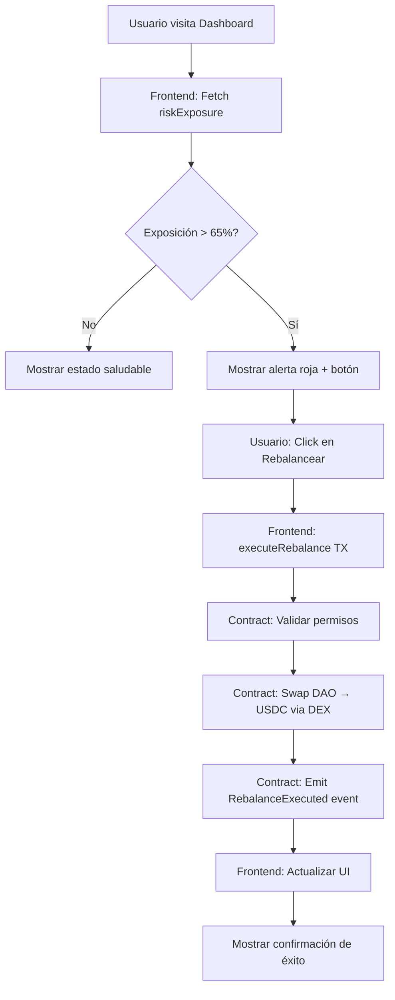
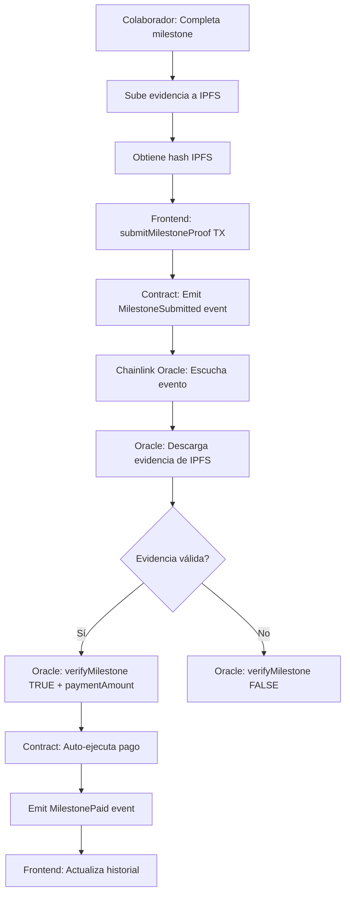
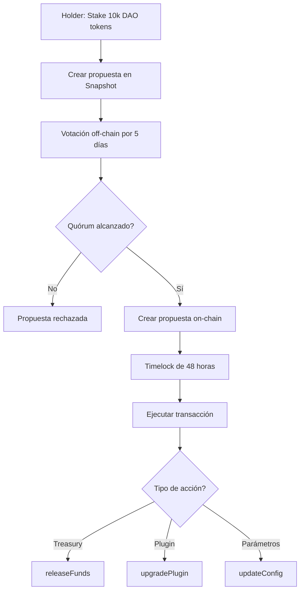

# 🏛️ BeZhas DAO - Arquitectura Core-Plugin

## 📋 Índice
- [Visión General](#visión-general)
- [Arquitectura de Contratos](#arquitectura-de-contratos)
- [Plugins Implementados](#plugins-implementados)
- [Integración Frontend](#integración-frontend)
- [Flujos de Trabajo](#flujos-de-trabajo)
- [Guía de Despliegue](#guía-de-despliegue)
- [Roadmap](#roadmap)

---

## 🎯 Visión General

BeZhas DAO es una **Organización Autónoma Descentralizada** que implementa el patrón de arquitectura **Core-Plugin**, inspirado en Aragon OSx. Este diseño permite:

- ✅ **Inmutabilidad del Core**: El contrato base (PluginManager) es inmutable y actúa como guardián de seguridad
- ✅ **Plugins Intercambiables**: La lógica de negocio reside en módulos actualizables sin afectar el Core
- ✅ **Seguridad Aislada**: Cada plugin tiene su propio scope de permisos con Kill Switch integrado
- ✅ **Escalabilidad**: Nuevos plugins pueden añadirse sin modificar contratos existentes

### Principios de Diseño

1. **Separation of Concerns**: Cada plugin maneja un dominio específico (Tesorería, HR, Gobernanza, Publicidad)
2. **Fail-Safe Mechanisms**: Sistema de emergency pause y revocación instantánea de permisos
3. **Transparent Automation**: Todas las acciones automatizadas emiten eventos para auditoría completa
4. **Oracle Integration**: Verificación descentralizada de datos externos vía Chainlink

---

## 🏗️ Arquitectura de Contratos

```
┌─────────────────────────────────────────────────────────┐
│                    DAO ARCHITECTURE                      │
└─────────────────────────────────────────────────────────┘

                    ┌──────────────────┐
                    │  PluginManager   │ (Core Inmutable)
                    │  - Permisos      │
                    │  - Kill Switch   │
                    │  - Upgrades      │
                    └────────┬─────────┘
                             │
                 ┌───────────┼───────────┐
                 │           │           │
         ┌───────▼─────┐ ┌──▼────────┐ ┌▼──────────┐
         │  Treasury   │ │     HR    │ │Governance │
         │   Plugin    │ │  Plugin   │ │  Plugin   │
         │             │ │           │ │           │
         │ Rebalanceo  │ │ Vesting   │ │ Votación  │
         │ Automático  │ │Milestones │ │ On-chain  │
         └─────────────┘ └───────────┘ └───────────┘
                             │
                    ┌────────▼─────────┐
                    │   Advertising    │
                    │     Plugin       │
                    │                  │
                    │   ERC-721 Ads    │
                    │  Revenue Split   │
                    └──────────────────┘
```

### Estructura de Directorios

```
contracts/dao/
├── core/
│   └── PluginManager.sol          # Guardián de permisos y seguridad
├── plugins/
│   ├── TreasuryPlugin.sol         # Gestión de activos + rebalanceo
│   ├── HumanResourcesPlugin.sol   # Vesting + milestones
│   ├── GovernancePlugin.sol       # Sistema híbrido de votación
│   └── AdvertisingPlugin.sol      # DePub Protocol (ERC-721)
├── interfaces/
│   └── IPlugin.sol                # Interfaz base para todos los plugins
└── libraries/
    ├── OracleIntegration.sol      # Helpers para Chainlink
    └── SafeMath.sol               # Utilidades matemáticas
```

---

## 🔌 Plugins Implementados

### 1. **Treasury Plugin** 💰

**Responsabilidad**: Gestión de activos de la DAO con rebalanceo automático.

**Características Clave**:
- ✅ Monitoreo de exposición al riesgo (umbral: 65% máximo en token nativo)
- ✅ Ejecución automática de swaps cuando se excede el umbral
- ✅ Integración con Gnosis Safe para transacciones grandes (>50k tokens)
- ✅ Registro completo de transacciones con razón y timestamp
- ✅ Support multi-token (Nativos, Stablecoins, RWA)

**Funciones Principales**:
```solidity
function checkRiskExposure() returns (bool needsRebalance, uint256 currentExposure)
function executeRebalance(address targetToken, uint256 amount)
function releaseFunds(address to, uint256 amount, string reason)
function getTotalValue() returns (uint256)
function getAssetComposition() returns (uint256, uint256, uint256)
```

**Lógica de Rebalanceo**:
```
1. Obtener composición actual del portfolio
2. Calcular % de exposición del token nativo
3. SI exposición > 65%:
   a. Calcular cantidad a swapear para llegar a 50%
   b. Ejecutar swap automático a USDC vía DEX
   c. Emitir evento RiskAlertTriggered
   d. Registrar transacción en historial
```

**Dashboard Frontend**: `/dao/treasury`
- Gráfico de pastel con composición de activos
- Gráfico de barras con flujo de caja (6 meses)
- Tabla de historial de transacciones
- Botón de rebalanceo manual (si auto falla)

---

### 2. **Human Resources Plugin** 👥

**Responsabilidad**: Compensación, vesting con cliff/lock-up y pagos por milestones.

**Características Clave**:
- ✅ Vesting lineal con cláusulas Cliff (carencia)
- ✅ Cálculo automático de tokens liberados por tiempo
- ✅ Sistema de hitos (Milestones) con verificación por oráculo
- ✅ Subida de evidencia a IPFS
- ✅ Revocación de vesting en caso de despido/incumplimiento

**Funciones Principales**:
```solidity
function createVestingSchedule(address beneficiary, uint256 amount, uint256 cliffDuration, uint256 vestingDuration)
function calculateReleasableAmount(address beneficiary) returns (uint256)
function release() // El beneficiario reclama sus tokens
function submitMilestoneProof(string ipfsHash)
function verifyMilestone(uint256 milestoneId, bool approved, uint256 paymentAmount) // Solo Oracle
function revokeVesting(address beneficiary)
```

**Fórmula de Liberación**:
```
Durante Cliff (primeros N días):
  → Tokens Disponibles = 0

Después del Cliff:
  → Tokens Disponibles = (TotalAsignado * TiempoTranscurrido) / DuraciónTotal - YaReclamado
  
Ejemplo:
  - Total: 100,000 tokens
  - Cliff: 90 días
  - Vesting: 730 días (2 años)
  - Día 100: (100,000 * 100) / 730 = 13,698 tokens disponibles
```

**Dashboard Frontend**: `/dao/talent`
- Barra de progreso visual de vesting
- Cards con tokens: Reclamados / Disponibles / Bloqueados
- Formulario de envío de milestones
- Historial de entregas con estados (Verified, Pending, Draft)
- Timeline de liberación de tokens

---

### 3. **Governance Plugin** 🗳️ (En Desarrollo)

**Responsabilidad**: Sistema híbrido de votación on/off-chain.

**Arquitectura Híbrida**:
```
┌────────────────────────────────────────────────┐
│          GOVERNANCE DUAL LAYER                  │
├────────────────────────────────────────────────┤
│                                                 │
│  Off-Chain (Snapshot)                          │
│  ├─ Señalización de preferencias               │
│  ├─ Gas-free voting                            │
│  └─ Mayor participación                        │
│                                                 │
│               ↓ (Si aprobado)                  │
│                                                 │
│  On-Chain (Smart Contract)                     │
│  ├─ Ejecución de transacciones                │
│  ├─ Liberación de fondos                       │
│  └─ Cambios en parámetros del protocolo       │
│                                                 │
└────────────────────────────────────────────────┘
```

**Barreras Anti-Spam**:
- Requiere stake de tokens para crear propuestas (ej: 10,000 DAO tokens)
- Threshold de participación mínima (quórum del 15%)
- Delay de ejecución de 48 horas (timelock)

**Dashboard Frontend**: `/dao/governance` (Próximamente)

---

### 4. **Advertising Plugin** 📢 (En Desarrollo)

**Responsabilidad**: Tokenización de inventario publicitario como NFTs (ERC-721).

**Modelo de Negocio**:
```
Ad Campaign NFT Minted
         ↓
Advertisers Buy Impressions
         ↓
Revenue Distribution:
  - 50% → Publisher (Propietario del inventario)
  - 30% → User (Quien ve el ad)
  - 20% → DAO Treasury
```

**Funciones Principales**:
```solidity
function mintAdCard(address publisher, string metadata, uint256 impressions) returns (uint256 tokenId)
function recordImpression(uint256 tokenId)
function distributeRevenue(uint256 tokenId, uint256 amount)
function getAdCardMetrics(uint256 tokenId) returns (uint256 impressions, uint256 clicks, uint256 revenue)
```

**Dashboard Frontend**: `/dao/advertising` (Próximamente)

---

## 🎨 Integración Frontend

### Stack Tecnológico

- **React 18** con Vite
- **React Router v6** para navegación
- **Tailwind CSS** para estilos
- **Recharts** para visualizaciones
- **Lucide React** para iconos
- **ethers.js / wagmi** para interacción con contratos (preparado)

### Estructura de Componentes

```
frontend/src/
├── pages/dao/
│   ├── DAOLayout.jsx              # Layout principal con navegación
│   ├── TreasuryDashboard.jsx      # Dashboard de Tesorería
│   ├── TalentDashboard.jsx        # Dashboard de RR.HH
│   ├── GovernanceDashboard.jsx    # (Próximamente)
│   └── AdvertisingDashboard.jsx   # (Próximamente)
├── components/dao/
│   ├── VestingCard.jsx            # Card de vesting reutilizable
│   ├── MilestoneForm.jsx          # Formulario de milestones
│   ├── ProposalCard.jsx           # Card de propuesta de gobernanza
│   └── TransactionTable.jsx       # Tabla de transacciones
└── hooks/dao/
    ├── useTreasuryContract.js     # Hook para Treasury Plugin
    ├── useHRContract.js           # Hook para HR Plugin
    └── useDAOStats.js             # Hook para estadísticas generales
```

### Ejemplo de Integración con Smart Contract

```javascript
// hooks/dao/useTreasuryContract.js
import { useContract, useContractRead } from 'wagmi';
import TreasuryPluginABI from '../../../abis/TreasuryPlugin.json';

const TREASURY_ADDRESS = "0x..."; // Dirección del contrato desplegado

export function useTreasuryContract() {
  const contract = useContract({
    address: TREASURY_ADDRESS,
    abi: TreasuryPluginABI,
  });

  // Leer exposición al riesgo
  const { data: riskData, refetch } = useContractRead({
    address: TREASURY_ADDRESS,
    abi: TreasuryPluginABI,
    functionName: 'checkRiskExposure',
  });

  // Ejecutar rebalanceo
  const executeRebalance = async (targetToken, amount) => {
    const tx = await contract.executeRebalance(targetToken, amount);
    await tx.wait();
    refetch(); // Actualizar datos después de la transacción
  };

  return {
    riskExposure: riskData?.[1] || 0,
    needsRebalance: riskData?.[0] || false,
    executeRebalance,
  };
}
```

---

## 🔄 Flujos de Trabajo

### Flujo 1: Rebalanceo Automático de Tesorería



### Flujo 2: Milestone Submission & Verification



### Flujo 3: Creación de Propuesta de Gobernanza



---

## 🚀 Guía de Despliegue

### Pre-requisitos

- Node.js v18+
- Hardhat o Foundry
- Cuenta en Alchemy/Infura (RPC provider)
- Cuenta en Etherscan (para verificación)
- Wallets con ETH/MATIC para gas

### Paso 1: Configuración del Entorno

```bash
# Clonar repositorio
cd bezhas-web3

# Instalar dependencias
npm install

# Configurar variables de entorno
cp .env.example .env
```

**.env**:
```env
# Network
NETWORK=sepolia
RPC_URL=https://sepolia.infura.io/v3/YOUR_KEY

# Deployer
PRIVATE_KEY=your_private_key_here
ETHERSCAN_API_KEY=your_etherscan_key

# Contracts (se llenarán después del deploy)
PLUGIN_MANAGER_ADDRESS=
TREASURY_PLUGIN_ADDRESS=
HR_PLUGIN_ADDRESS=
GOVERNANCE_PLUGIN_ADDRESS=

# Oracle
CHAINLINK_ORACLE_ADDRESS=0x...
USDC_ADDRESS=0x...
```

### Paso 2: Desplegar Contratos

```bash
# Compilar contratos
npx hardhat compile

# Desplegar en testnet (Sepolia)
npx hardhat run scripts/deploy-dao.js --network sepolia
```

**scripts/deploy-dao.js**:
```javascript
const { ethers } = require("hardhat");

async function main() {
  console.log("🚀 Iniciando despliegue de DAO...\n");

  // 1. Desplegar PluginManager (Core)
  const PluginManager = await ethers.getContractFactory("PluginManager");
  const pluginManager = await PluginManager.deploy();
  await pluginManager.deployed();
  console.log("✅ PluginManager desplegado:", pluginManager.address);

  // 2. Desplegar TreasuryPlugin
  const TreasuryPlugin = await ethers.getContractFactory("TreasuryPlugin");
  const treasuryPlugin = await TreasuryPlugin.deploy(
    pluginManager.address,
    GOVERNANCE_TOKEN_ADDRESS,
    GNOSIS_SAFE_ADDRESS
  );
  await treasuryPlugin.deployed();
  console.log("✅ TreasuryPlugin desplegado:", treasuryPlugin.address);

  // 3. Autorizar TreasuryPlugin en PluginManager
  await pluginManager.authorizePlugin(
    treasuryPlugin.address,
    "Treasury",
    "1.0.0"
  );
  console.log("✅ TreasuryPlugin autorizado\n");

  // 4. Desplegar HRPlugin
  const HRPlugin = await ethers.getContractFactory("HumanResourcesPlugin");
  const hrPlugin = await HRPlugin.deploy(
    pluginManager.address,
    GOVERNANCE_TOKEN_ADDRESS,
    CHAINLINK_ORACLE_ADDRESS
  );
  await hrPlugin.deployed();
  console.log("✅ HRPlugin desplegado:", hrPlugin.address);

  // 5. Autorizar HRPlugin
  await pluginManager.authorizePlugin(
    hrPlugin.address,
    "HumanResources",
    "1.0.0"
  );
  console.log("✅ HRPlugin autorizado\n");

  // Guardar direcciones en archivo
  const addresses = {
    pluginManager: pluginManager.address,
    treasuryPlugin: treasuryPlugin.address,
    hrPlugin: hrPlugin.address,
  };

  fs.writeFileSync(
    "deployed-addresses.json",
    JSON.stringify(addresses, null, 2)
  );

  console.log("📝 Direcciones guardadas en deployed-addresses.json");
}

main();
```

### Paso 3: Verificar Contratos en Etherscan

```bash
npx hardhat verify --network sepolia PLUGIN_MANAGER_ADDRESS
npx hardhat verify --network sepolia TREASURY_PLUGIN_ADDRESS "PLUGIN_MANAGER_ADDRESS" "GOVERNANCE_TOKEN_ADDRESS" "GNOSIS_SAFE_ADDRESS"
npx hardhat verify --network sepolia HR_PLUGIN_ADDRESS "PLUGIN_MANAGER_ADDRESS" "GOVERNANCE_TOKEN_ADDRESS" "ORACLE_ADDRESS"
```

### Paso 4: Configurar Frontend

```javascript
// frontend/src/config/dao-contracts.js
export const DAO_CONTRACTS = {
  pluginManager: "0x...", // De deployed-addresses.json
  treasury: "0x...",
  hr: "0x...",
  governance: "0x...",
};

export const SUPPORTED_NETWORKS = {
  sepolia: {
    chainId: 11155111,
    name: "Sepolia",
    rpcUrl: "https://sepolia.infura.io/v3/...",
  },
};
```

### Paso 5: Levantar Frontend

```bash
cd frontend
npm install
npm run dev
# Abrir http://localhost:5173/dao
```

---

## 📈 Roadmap

### ✅ Fase 1: Core & Tesorería (COMPLETADO)
- [x] PluginManager con Kill Switch
- [x] TreasuryPlugin con rebalanceo automático
- [x] Dashboard de Tesorería con visualizaciones
- [x] Integración con Gnosis Safe

### ✅ Fase 2: RR.HH (COMPLETADO)
- [x] HRPlugin con vesting lineal + cliff
- [x] Sistema de milestones con IPFS
- [x] Dashboard de Talento
- [x] Preparación para integración con oráculo

### 🔄 Fase 3: Gobernanza (EN DESARROLLO)
- [ ] GovernancePlugin con votación on-chain
- [ ] Integración con Snapshot para off-chain
- [ ] Sistema de stake para propuestas
- [ ] Timelock de 48 horas
- [ ] Dashboard de votación

### 📅 Fase 4: Publicidad DePub (Q1 2026)
- [ ] AdvertisingPlugin con ERC-721
- [ ] Sistema de revenue split automatizado
- [ ] Marketplace de inventario publicitario
- [ ] Dashboard de métricas de ads

### 📅 Fase 5: Integración con Oráculos (Q2 2026)
- [ ] Chainlink Price Feeds para precios en USD
- [ ] Chainlink Functions para verificación de milestones
- [ ] Chainlink Automation para rebalanceo automático
- [ ] UMA Optimistic Oracle para disputas

### 📅 Fase 6: Auditoría & Mainnet (Q3 2026)
- [ ] Auditoría de seguridad (Certora, Trail of Bits)
- [ ] Bug Bounty Program en Immunefi
- [ ] Despliegue en Mainnet
- [ ] Gnosis Safe setup con multi-sig del equipo

---

## 🔐 Consideraciones de Seguridad

### Vectores de Ataque Mitigados

1. **Reentrancy**: Uso de `ReentrancyGuard` en todos los plugins
2. **Integer Overflow**: Solidity 0.8+ con checks automáticos
3. **Access Control**: Sistema robusto de roles con AccessControl de OpenZeppelin
4. **Front-Running**: Uso de commit-reveal en votaciones (Fase 3)
5. **Flash Loan Attacks**: Timelock obligatorio en cambios críticos
6. **Sandwich Attacks**: Slippage protection en swaps de rebalanceo

### Best Practices Implementadas

- ✅ **Pausable**: Todos los plugins tienen emergency pause
- ✅ **Upgradeable**: Patrón de plugins intercambiables sin proxy
- ✅ **Event Emission**: 100% de acciones críticas emiten eventos
- ✅ **Input Validation**: Checks de require/revert en todas las funciones públicas
- ✅ **Gas Optimization**: Uso de `calldata` en lugar de `memory` donde es posible
- ✅ **Natspec Comments**: Documentación completa en todos los contratos

---

## 🤝 Contribuir

### Setup de Desarrollo

```bash
# Clonar repo
git clone https://github.com/bezhas/bezhas-web3.git
cd bezhas-web3

# Instalar deps
npm install

# Correr tests
npm test

# Cobertura
npm run coverage
```

### Convenciones de Código

- **Solidity**: Seguir [Solidity Style Guide](https://docs.soliditylang.org/en/v0.8.19/style-guide.html)
- **JavaScript**: ESLint + Prettier configurados
- **Commits**: Conventional Commits (`feat:`, `fix:`, `docs:`)
- **Branches**: `feature/nombre`, `bugfix/descripcion`

---

## 📞 Soporte

- **Documentación**: [https://docs.bezhas.io/dao](https://docs.bezhas.io/dao)
- **Discord**: [https://discord.gg/bezhas](https://discord.gg/bezhas)
- **GitHub Issues**: [https://github.com/bezhas/bezhas-web3/issues](https://github.com/bezhas/bezhas-web3/issues)
- **Email**: dao@bezhas.io

---

## 📜 Licencia

MIT License - Ver [LICENSE](../LICENSE) para detalles.

---

**Construido con ❤️ por el equipo de BeZhas**

*Última actualización: 18 de Noviembre, 2025*
