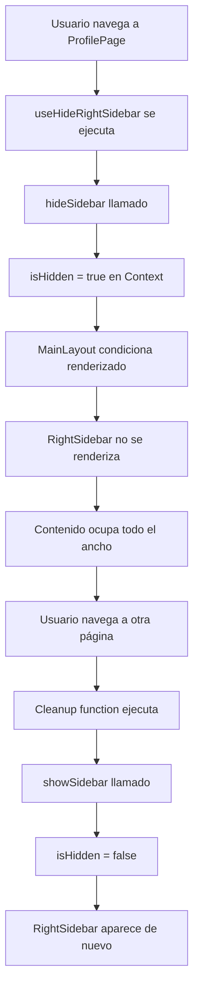

# 🎯 Implementación de Auto-Ocultar Sidebar

## 📋 Resumen

Se ha implementado un sistema inteligente para ocultar automáticamente la columna lateral derecha (RightSidebar) en páginas que necesitan más espacio horizontal para mostrar su contenido de forma óptima.

## 🔧 Solución Técnica

### Hook Personalizado: `useHideRightSidebar`

Se creó un hook reutilizable que encapsula la lógica de ocultar/mostrar el sidebar:

**Ubicación**: `frontend/src/hooks/useHideRightSidebar.js`

```javascript
import { useEffect } from 'react';
import { useRightSidebar } from '../context/RightSidebarContext';

export const useHideRightSidebar = () => {
    const { hideSidebar, showSidebar } = useRightSidebar();

    useEffect(() => {
        hideSidebar();  // Oculta cuando el componente se monta
        
        return () => {
            showSidebar();  // Restaura cuando el componente se desmonta
        };
    }, [hideSidebar, showSidebar]);
};
```

### Características del Hook

✅ **Automático**: Se ejecuta al montar el componente
✅ **Limpio**: Restaura el sidebar al salir de la página
✅ **Simple**: Una línea de código para implementar
✅ **Reutilizable**: Mismo hook para todas las páginas
✅ **Tipado**: Compatible con TypeScript

## 📄 Páginas Implementadas

Se ha aplicado el auto-ocultamiento en las siguientes páginas:

### 1. **ProfilePageNew** (`ProfilePageNew.jsx`)
```javascript
import { useHideRightSidebar } from '../hooks/useHideRightSidebar';

const ProfilePage = () => {
    useHideRightSidebar();
    // ... resto del componente
};
```

**Motivo**: La página de perfil muestra mucha información (overview, wallet, settings) y necesita espacio horizontal completo.

---

### 2. **DashboardPage** (`DashboardPage.jsx`)
```javascript
import { useHideRightSidebar } from '../hooks/useHideRightSidebar';

const DashboardPage = () => {
    useHideRightSidebar();
    // ... resto del componente
};
```

**Motivo**: El dashboard tiene múltiples widgets y gráficos que se benefician del espacio extra.

---

### 3. **WalletPage** (`WalletPage.jsx`)
```javascript
import { useHideRightSidebar } from '../hooks/useHideRightSidebar';

const WalletPage = () => {
    useHideRightSidebar();
    // ... resto del componente
};
```

**Motivo**: La página de wallet muestra balances, transacciones e historial que requieren visualización amplia.

---

### 4. **GroupDetailPage** (`GroupDetailPage.jsx`)
```javascript
import { useHideRightSidebar } from '../hooks/useHideRightSidebar';

const GroupDetailPage = ({ groupsContract, governanceContract, userProfileContract, groupPostsContract }) => {
    useHideRightSidebar();
    // ... resto del componente
};
```

**Motivo**: Los detalles del grupo incluyen posts, miembros, configuración y gobernanza que necesitan espacio.

---

### 5. **ForumsPage** (`ForumsPage.jsx`)
```javascript
import { useHideRightSidebar } from '../hooks/useHideRightSidebar';

const ForumsPage = ({ forumsContract, userProfileContract }) => {
    useHideRightSidebar();
    // ... resto del componente
};
```

**Motivo**: Los hilos del foro con títulos, autores y respuestas se leen mejor con más ancho.

---

### 6. **MarketplacePage** (`MarketplacePage.jsx`)
```javascript
import { useHideRightSidebar } from '../hooks/useHideRightSidebar';

const MarketplacePage = () => {
    useHideRightSidebar();
    // ... resto del componente
};
```

**Motivo**: La cuadrícula de NFTs del marketplace se muestra mejor con todo el ancho disponible.

---

### 7. **UserManagementPage** (`UserManagementPage.jsx`)
```javascript
import { useHideRightSidebar } from '../hooks/useHideRightSidebar';

export default function UserManagementPage() {
    useHideRightSidebar();
    // ... resto del componente
}
```

**Motivo**: Las tablas de administración de usuarios necesitan espacio horizontal para mostrar todas las columnas.

---

## 🎯 Cómo Agregar a Nuevas Páginas

Si tienes una nueva página que necesita ocultar el sidebar:

### Paso 1: Importar el hook
```javascript
import { useHideRightSidebar } from '../hooks/useHideRightSidebar';
```

### Paso 2: Usar en el componente
```javascript
const MyNewPage = () => {
    useHideRightSidebar();  // ← Una sola línea!
    
    // Tu código aquí...
    return (
        <div>
            {/* Tu contenido */}
        </div>
    );
};
```

## 🔄 Flujo de Funcionamiento



## 📊 Ventajas del Enfoque

✅ **DRY (Don't Repeat Yourself)**: Un hook reutilizable en lugar de código duplicado
✅ **Mantenibilidad**: Cambios futuros solo en un archivo
✅ **Consistencia**: Mismo comportamiento en todas las páginas
✅ **Declarativo**: El código expresa claramente la intención
✅ **Performance**: Cleanup automático previene memory leaks
✅ **Escalabilidad**: Fácil agregar a nuevas páginas

## 🧪 Testing

Para verificar que funciona correctamente:

1. **Navega a una página con el hook** (ej: `/profile`)
   - ✅ El sidebar debe desaparecer
   - ✅ El contenido debe ocupar todo el ancho

2. **Navega a una página SIN el hook** (ej: `/feed`)
   - ✅ El sidebar debe aparecer de nuevo
   - ✅ En desktop (≥1280px) debe estar visible
   - ✅ En mobile (<1280px) debe aparecer el toggle button

3. **Alterna entre páginas**
   - ✅ No debe haber flickering
   - ✅ Las transiciones deben ser suaves
   - ✅ No debe haber errores en consola

## 🔮 Mejoras Futuras Potenciales

- [ ] Agregar transición animada al ocultar/mostrar
- [ ] Permitir configuración por ruta en un archivo central
- [ ] Añadir persistencia de preferencia de usuario
- [ ] Implementar sistema de "pin" para forzar visibilidad
- [ ] Agregar analytics para medir uso

## 📝 Notas Adicionales

- El hook respeta el ciclo de vida de React (mount/unmount)
- Compatible con React Router DOM
- No interfiere con el comportamiento responsive existente
- El sidebar en mobile sigue funcionando con el toggle button cuando es visible

## 🐛 Solución de Problemas

### El sidebar no se oculta
- Verifica que el import sea correcto: `../hooks/useHideRightSidebar`
- Asegúrate de llamar el hook dentro del componente, no fuera
- Revisa que RightSidebarContext esté envolviendo el componente

### El sidebar no reaparece al salir
- Verifica que no hay errores en consola que interrumpan el cleanup
- Asegúrate de no tener múltiples Providers de RightSidebarContext
- Revisa que la navegación use React Router, no window.location

### Flickering al cambiar de página
- Normal en development mode (HMR)
- En producción debe ser imperceptible
- Si persiste, verifica que no haya re-renders innecesarios

---

**Última actualización**: Diciembre 2024
**Autor**: BeZhas Development Team
